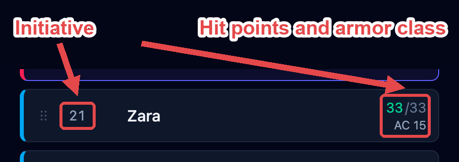

Everyone in a fight is added in one of three ways. The difference is how much OpenFray
knows about them, not how they take their turn.

## The three kinds

### Creatures

Click **Add creature** to pick one from the [compendium](/docs/concepts/compendium/). You
get the whole creature: its abilities, attacks, reactions, legendary actions, and spells.
OpenFray rolls its dice for you, because it has all the numbers.

When you add a creature, OpenFray takes its own copy. Editing the creature in the library
later won't touch one already in a fight, and damage or spells used in a fight won't
change the library.

### Players

Players roll their own dice, so a player character stays simple — just what you, the Game
Master, want to see on the board:

- always: name, armor class, hit points, and conditions;
- if you want: ability scores, senses, speed, damage the character resists or is immune
  to, languages, and notes.

OpenFray never rolls a player's attacks or saves. Wherever it would roll for a creature,
you type in what the player rolled instead.

### Throwaway creatures

**Quick add** drops in something you're inventing on the spot and won't reuse — just a
name, hit points, and armor class. Mark it a foe to group it with the other foes.

## Reading a row

Every row in the tracker holds the four things you check most often.

Click the hit points to set a new number, or to add or remove some — type `+5` to heal or
`-8` to damage. Current hit points change color as a creature gets hurt, so you can spot
a badly wounded one at a glance. Temporary hit points are counted separately and used up
first.

## Down, dead, and back again

Everyone is **active**, **unconscious**, or **dead**. Nothing is ever deleted: down and
dead creatures stay in the order, grayed out and skipped, so they're right there if
they're brought back.

A creature at 0 is marked dead. A player character is marked unconscious, and OpenFray
starts tracking their death saves.

## Death saves

A downed player's row is tagged **Unconscious** and grows a set of pips — successes on one
line, failures on the other — so the tally is visible without opening anything.

Select them and their controls grow three buttons:

- **Save** and **Fail** record what the player rolled. That's the normal path: they roll
  their own die, you tap what happened.
- **Roll death save** is the fallback for when they can't roll — OpenFray rolls it and
  records the result itself.

Once the tally resolves, OpenFray stops asking: a stabilized character keeps a **Stable**
tag on their row, and a dead one grays out in the order. Either way they stay in the
list, in their own initiative slot.

Four things it applies on its own, so nothing is missed in the middle of a fight:

| When                                  | OpenFray does this                                               |
| ------------------------------------- | ---------------------------------------------------------------- |
| You deal damage to a downed character | Records the failure with the damage                              |
| That damage came from a melee hit     | Records it as a critical — two failures                          |
| **Roll death save** comes up 20       | Puts them back on their feet at 1 hit point and clears the tally |
| **Roll death save** comes up 1        | Records two failures                                             |

Damaging a **stable** character clears their successes before applying the failure, so
the row goes straight back to dying rather than quietly staying stable.

Healing above 0 wakes them: the status goes back to active, the tally clears, and they
keep their place in the order — no re-rolling initiative.

## Copies and renaming

Add the same creature twice and the second is named **Goblin 2** for you — that's just a
number to tell them apart, so its stat block still says _Goblin_. If you rename one
yourself, it shows your name with the real one after it (_Snik (Goblin)_), so you always
know what it actually is.

## Hiding things from players

:::note[Coming later]
This isn't in OpenFray yet — it's planned for a future update.
:::

Later, OpenFray will have a screen players can look at, and each creature will let you
choose what they see: its name, its hit points (the exact number, just _bloodied_, or
nothing), its conditions, and its armor class.
