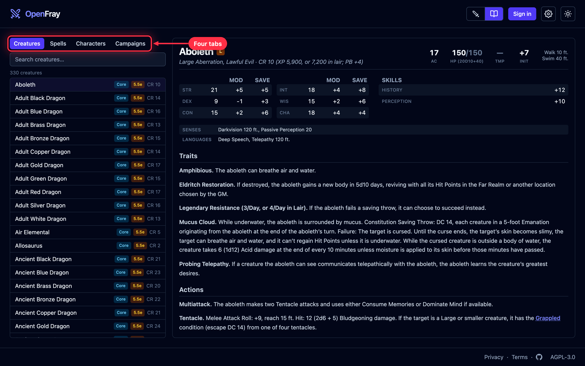
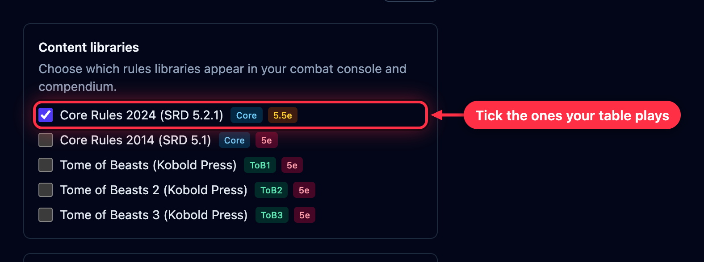

The **compendium** is the reference OpenFray keeps for you. Open it with the book icon at
the top of the screen. It has four tabs: search on the left, read on the right.

## Creatures

Every creature you can use, with its full stat block. This is the same list you pick from
when you click **Add creature** — choosing one there drops a copy into your fight.

Each row is badged with the book it came from and which rules it uses, so you always know
what you're looking at.

## Spells

Every spell in the [rule sets you have turned on](#rule-sets), with its full card:
casting time, range, components, how long it lasts, and what it does. You'll see the same
card when you cast a spell, or when you point at a spell name inside a stat block.

## Characters

Your saved players. Build a character once — armor, hit points, abilities, notes — and
drop them into any fight instead of typing them in again. This one needs an account.

## Campaigns

Your games and their house rules. See
[Campaigns & house rules](/docs/concepts/campaigns/). This one needs an account too.

## Rule sets

OpenFray ships with more than one set of rules, and with two extra books of creatures.
Open **Settings** (the gear at the top right) and tick the ones your table uses:

- **Core Rules 2024** — the newer rules. On by default.
- **Core Rules 2014** — the older rules. Turn this on if that's what your table plays.
- **Tome of Beasts 1, 2 and 3** — three books of extra creatures from Kobold Press.

You don't need an account for this; the choice is remembered in your browser. Whatever
you turn on shows up in the compendium and in the **Add creature** list, badged with
where it came from. Creatures and spells you make yourself always show up, whichever sets
are on.

Some spells work differently between the two versions of the rules (Barkskin's armor
class, how Sleep works). Each rule set carries its own version, so you get the one that
matches what you're playing.

## Making your own

With an account you can build your own **creatures** and **spells** in a full editor, and
they're kept in your library next to the built-in ones. To turn a D&D&nbsp;Beyond
creature into an OpenFray creature without retyping it, see
[the importer](/docs/importer/).

:::note[Where the rules come from]
The built-in rules come from the official System Reference Document, used under the
CC-BY-4.0 license. The Tome of Beasts books are used under the Open Game License. Full
credit for every source is in the app. OpenFray is compatible with fifth edition and
isn't made or approved by Wizards of the Coast.
:::
