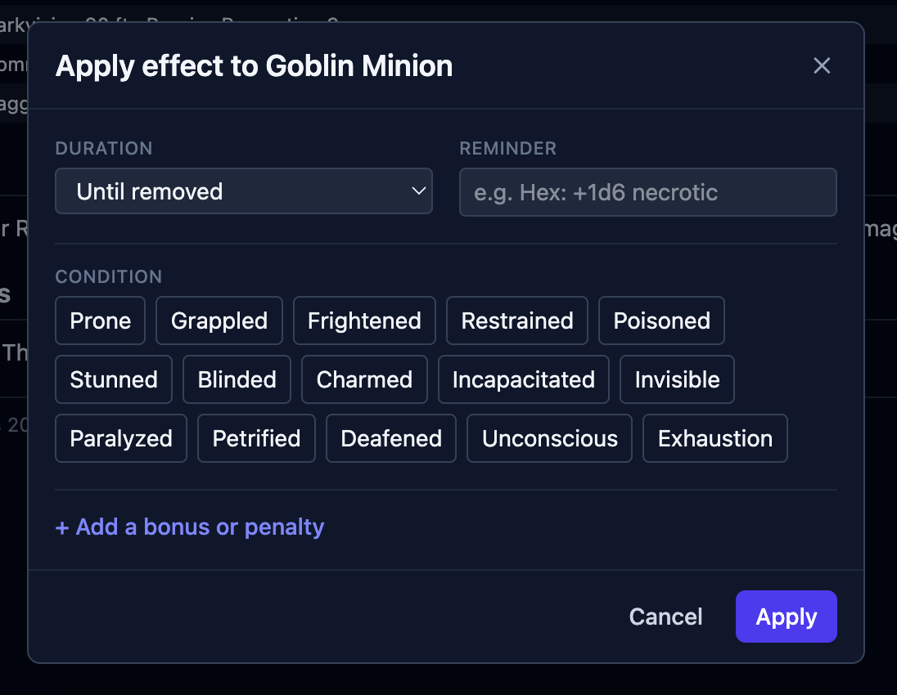
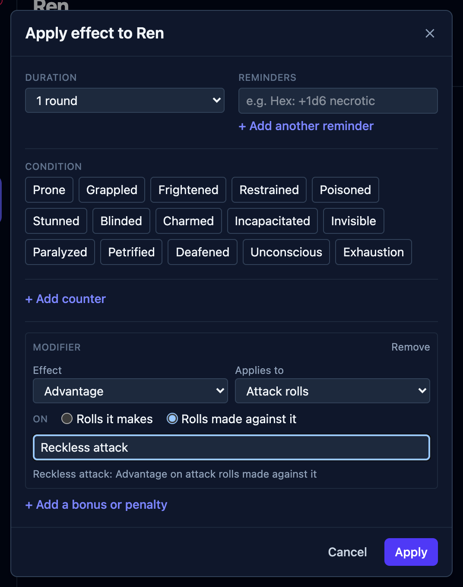
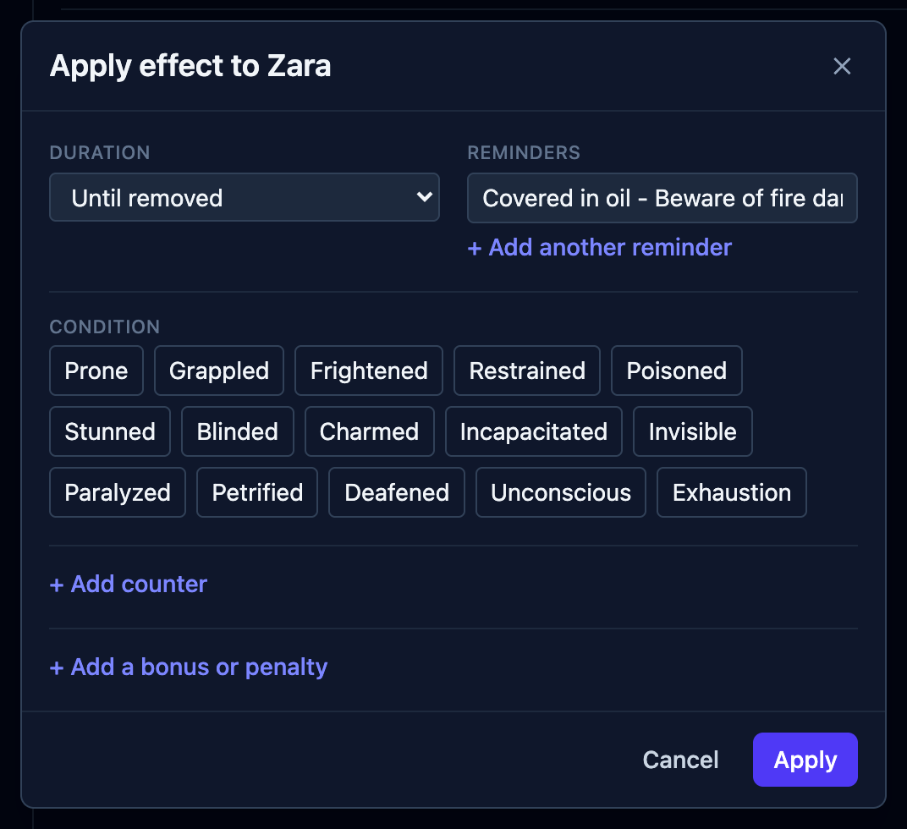
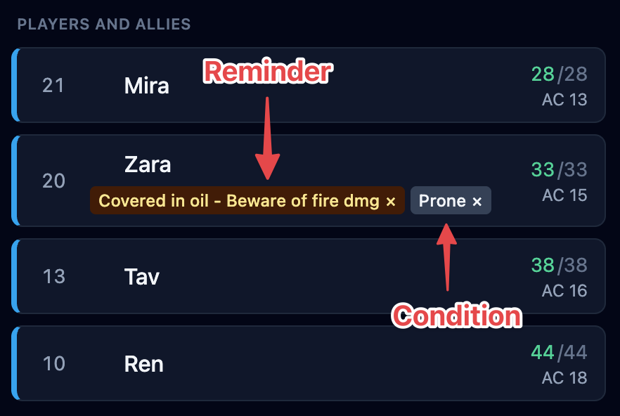
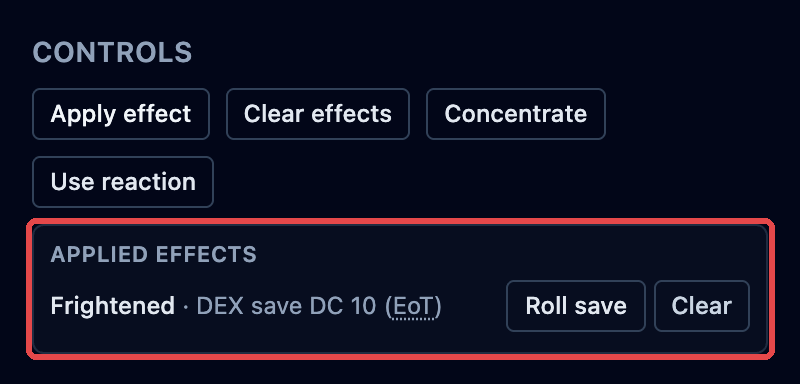

During a fight, little things pile up: this creature is frightened, that one has
advantage, someone is blessed. OpenFray keeps track of all of it. Every one of these is
an **effect**, and they all work the same way.

## The kinds of effect

Whatever spell or ability caused it, what lands on a creature is always one of these:

| Kind                                  | Examples                                         |
| ------------------------------------- | ------------------------------------------------ |
| **A condition**                       | Prone, Frightened, Paralyzed, Poisoned           |
| **Attacks against it have advantage** | Faerie Fire, attacking a prone creature in melee |
| **Its own rolls have disadvantage**   | Vicious Mockery, Bane                            |
| **A bonus or penalty**                | Bless (+1d4), Bane (−1d4), +2 to armor class     |
| **A reminder**                        | a note to yourself, like "Hex: +1d6 on a hit"    |
| **Ends on a save**                    | something a saving throw shakes off              |

Conditions are just one kind of effect, so there's only one thing to learn. You tell
OpenFray what happened; it remembers it and works it into the right rolls.

## Adding an effect

Click the creature in the tracker, then click **Apply effect** in the controls beside its
stat block. Everything happens in one box, and it stays open while you work — so you can
put several things on the same creature before closing it.

**1 · Set how long it lasts, first.** This one setting applies to everything you add
while the box is open, so start here:

| Choice                      | Use it for                                                                                                                                                  |
| --------------------------- | ----------------------------------------------------------------------------------------------------------------------------------------------------------- |
| **1 round** … **24 hours**  | anything with a stated duration — a spell, a potion                                                                                                         |
| **This turn / next attack** | something used up by the next roll (Vicious Mockery)                                                                                                        |
| **Save ends**               | something the creature can shake off — it then asks which save, the number to beat, and whether it's rolled at the start or the end of that creature's turn |
| **Until removed**           | you'll clear it yourself when the story says so                                                                                                             |

Change it later and everything you've already added in this box changes with it — so
it's fine to tap a condition first and pick the duration after.

**2 · Tap a condition.** Prone, Grappled, Frightened, and the rest. These are toggles:
the ones already on the creature are highlighted, and tapping one again takes it off.

**3 · Or build a bonus.** Three dropdowns make a sentence — _what_ it does (advantage,
disadvantage, or a number), _what it applies to_ (attacks, saves, checks, or everything),
and _whose rolls_ (the creature's own, or rolls made against it). Give it a name, like
Bless or Reckless, so you recognize it on the board later. OpenFray spells out what
you've built in plain English; press **Apply modifier** when it reads right.

**4 · Or just leave a note.** For anything that doesn't fit the boxes above, type a
reminder and press **Add**. OpenFray shows it and reminds you; you decide what it does.

Whatever you've added is listed along the bottom of the box. **Done** closes it.

:::tip[Casting a spell? Don't come here first]
When a spell leaves something behind, **Cast spell** offers to put it on the board for
you — already named, already timed, already linked to concentration. This box is for
everything else: the things nothing in the app knows about. See
[Spells](/docs/concepts/spells/).
:::

## Two worked examples

### "I attack recklessly"

The barbarian's player announces it. There's no spell to cast and nothing on any stat
block — but for the rest of the round, attacks against him land more easily, and that's
the sort of thing you'll otherwise forget by the time the ogre swings.

1. Click the barbarian, then **Apply effect**.
2. **Duration → 1 round**, so it clears itself when his turn comes round again.
3. In **Modifier**: _Advantage_ · on _Attack rolls_ · on **Rolls made against it**. That
   last choice is the one to get right — it's not his attacks that change, it's everyone
   else's attacks on him.
4. Name it **Reckless**, so the badge on his row says why.
5. Check the line OpenFray writes back — _"Reckless: Advantage on attack rolls made
   against it"_ — and press **Apply modifier**.

Now when the ogre swings at him, OpenFray rolls with advantage on its own, shows both
dice, and names Reckless as the reason.

### Something you just made up

A flask of oil goes over the floor. There's no condition for that and no spell involved —
you just don't want to forget it two rounds from now.

1. Click whoever is standing in it, then **Apply effect**.
2. **Duration → Until removed**, because it ends when the story says so.
3. Type the note in **Reminder** and press **Add**.

It becomes a badge on their row like any other effect. OpenFray won't act on it — it
can't know what you meant — but it will keep it in front of you until you clear it. That's
the deal with reminders: you get the memory, you keep the judgment.

## Where effects show up

Each effect shows as a small **badge** under the creature's name in the tracker — just
the name, so the row stays easy to read at a glance.

The details live in the **Applied effects** list, in the controls beside the stat block.
There, each effect shows how it ends and carries its own buttons.

- **Clear** removes it.
- For an effect that ends on a save, **Roll save** rolls it, and the line shows the
  ability and number needed.

## How long effects last

Every effect knows when it ends, and the Applied effects list tells you:

- effects that last a number of **rounds** count down and show what's left ("10 rounds
  left"); once that's more than about ten minutes, it shows the time instead ("1 hour
  left");
- **ends on a save** shows the ability and number, like `WIS save DC 15`;
- some clear the next time the creature rolls (Vicious Mockery);
- some clear when the creature that caused them takes its next turn;
- the rest stay until you clear them, and keep the spell's own wording where OpenFray
  can't count it down ("8 hours").

### Effects a saving throw ends

Some effects hang on until the creature makes a saving throw — a paralysis, an ongoing
burn. Each one gets **its own** save: two effects that happen to need the same number
still roll separately, because they came from different sources. On a creature's turn,
OpenFray rolls these for you, at the start or end of the turn as you chose. For a player,
use **Roll save** to record their roll, or just **Clear** it when they pass.

## Concentration

Mark a creature as **concentrating**, and add the spell's name if you like. Since
concentration is what keeps a spell going, **ending it removes that spell's effects from
everyone at once** — break the caster's concentration on Bless and all three allies lose
it together. Concentration also drops on its own when its timer runs out, and a creature
can be asked to make a concentration check when it takes damage.
