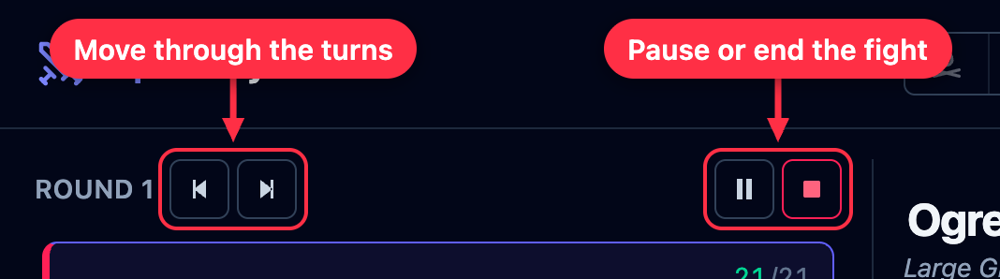
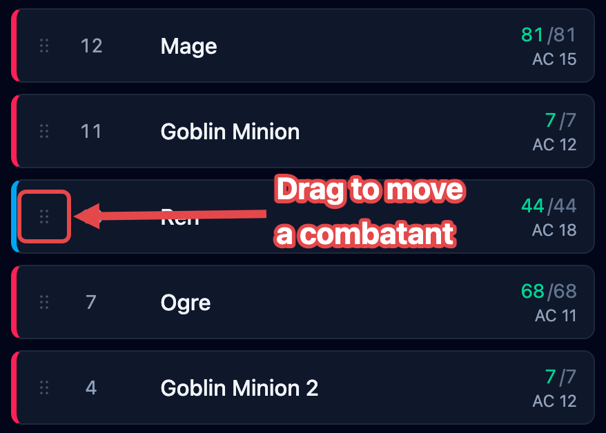

An **encounter** is the fight you're running: everyone in it, the order they act, and
which round you're on. The left column — the **tracker** — is where it all happens.

## Setting the order

Add everyone before the fight starts (see [Getting started](/docs/getting-started/)).
Until you begin, players and foes sit in separate groups so you can see both sides.

Click **Begin** and OpenFray asks for everyone's initiative. Creatures are rolled for
you. Players are blank, so you can type what they rolled, or leave it blank and let
OpenFray roll. You can also mark someone **surprised** here — what that does depends on
your campaign's [surprise rule](/docs/concepts/campaigns/#house-rules).

Click **Start combat** and you're in round 1, at the top of the list.

## Rounds and turns

The creature whose turn it is glows in the tracker, and its stat block fills the middle
of the screen. The buttons beside the round number move the fight along.

:::caution[Going back is a fix, not an undo]
**Previous turn** moves the marker back and nothing else. It does **not** put things
back the way they were — timers that counted down, a used reaction, or lost
concentration all stay as they are. Use it when you clicked ahead by mistake, not to
replay a turn.
:::

**Pause** holds the fight while the session stops. The turn marker disappears so nobody is
"up", and the footer timers stop counting. Press it again to carry on where you left off.

**Stop** ends the fight. Everyone stays on the board with their hit points, effects, and
conditions intact; the round counter resets and the ▶ button comes back. Nothing is lost,
so stopping by mistake is safe.

Two clocks run in the footer while you fight: **Real**, the time you've actually spent
(pauses don't count), and **In-game**, six seconds per round. Use the in-game clock to
tell a player how long a timed spell has left.

## What moving to the next turn does

Clicking **Next turn** does more than move the marker. Each time, OpenFray:

- counts down effects that last a set number of rounds, and removes the ones that run
  out;
- gives the creature back its reaction, and refreshes its legendary actions;
- clears effects that last "until my next turn" as their owner starts to act;
- counts down concentration and drops it when it runs out;
- rolls a creature's [saves to shake off an effect](/docs/concepts/effects/#effects-a-saving-throw-ends)
  at the right moment in its turn;
- rolls to see whether a used-up recharge ability is available again.

OpenFray follows whose turn it is by the creature itself, not by its place in the list —
so adding, removing, or dragging creatures around never loses the turn.

## Rearranging the order

Sometimes the order needs a nudge — someone held their action, or you typed a number
wrong. Once the fight is running, every living row grows a **drag handle**: the six small
dots on the far left of the row, before the initiative number.

Drag that handle up or down to move the creature. Its initiative changes to fit its new
spot, and nobody else's number moves. Creatures that are down or dead stay in the list,
grayed out and skipped, so the order holds steady if they come back.

## The summary

When the last foe is defeated, OpenFray asks once whether the fight is over. Say no if a
second wave is coming; it won't ask again. Say yes and you get a summary of the fight:

- **the outcome** — victory, defeat, or simply ended;
- **experience earned**, and what that is per player — unless your campaign levels up by
  [milestone](/docs/concepts/campaigns/#leveling-up-experience-or-milestone), in which
  case it's left out;
- **how long it took**: rounds, in-game minutes, and real time with pauses excluded;
- **total damage** dealt and taken;
- **three awards** — most damage dealt, most taken, and the biggest single hit.

The summary also appears when you press **Stop**, or when the whole party goes down. A
party wipe only counts once every player is dead or stable: one character still rolling
death saves means the fight is still on.
