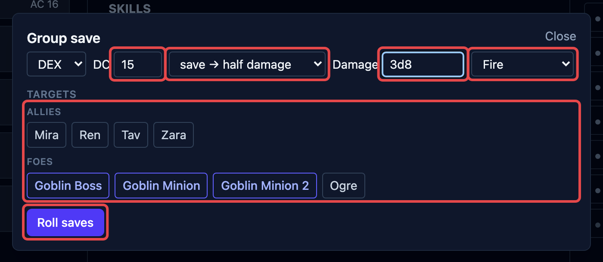

OpenFray helps you _run_ a spell without playing the rulebook at you. It handles the
dice, offers to put the spell's effect on the board, and shows you the spell's card so
you can read what it does.

## Casting a spell

There are two ways to cast.

**From a creature.** Open its stat block and click a spell in its list. OpenFray fills in
the save number and attack bonus from that creature, and spends one casting: an _At will_
spell is unlimited, while a _2/Day Each_ spell counts down per spell — burning a Fireball
leaves its Invisibility untouched — and grays out when it's spent.

Monster spells cast at the level printed on the stat block. There's no upcasting to pick,
because a stat block doesn't have spell slots to spend.

**From the Cast spell button**, at the top of the screen. Search any spell — every spell
in the [rule sets you've turned on](/docs/concepts/compendium/#rule-sets), plus your own —
then pick **who is casting it**.

Naming a caster is worth doing: OpenFray takes their save DC and spell attack bonus, and
if the spell needs concentration it starts the caster concentrating, with the timer
already counting. Leave the caster blank and you can still cast — you just type the
numbers yourself. That's the path for a player's spell, where OpenFray has no sheet to
read from.

What happens next depends on the spell:

- an **attack** spell opens the attack box — roll to hit, then deal damage;
- a **saving throw** spell opens the [group save](#group-saves) box, already filled in;
- a **helpful or utility** spell shows its card.

## Putting a spell's effect on the board

Lots of spells leave something behind on a creature — a bonus, a condition, a note. When
a spell has one of those, OpenFray offers to **add it to the board** after you cast, so
you don't have to build it by hand:

- **Bless** → +1d4 on attacks and saves, for the creatures you pick;
- **Fly** → a _Fly Speed 60_ reminder;
- **Hold Person** → Paralyzed, with the saving throw already set up;
- **Mage Armor** → the new armor class, worked out from the target's Dexterity.

Spells that only affect the caster (like Speak with Animals) go straight onto them — no
need to pick a target. For a saving throw spell, OpenFray offers to put the effect on the
creatures that **failed**.

:::note[You're still in charge]
OpenFray never makes up numbers. It adds the one thing a spell leaves behind, and you can
change or clear it any time. For spells that only add extra damage (like Hex), you get a
reminder badge — you add the extra dice yourself when you roll.
:::

Every spell you cast is written into the log. When a spell needs concentration, OpenFray
marks it as such, so ending concentration clears it everywhere at once.

## Group saves

**Group save** is the Fireball moment: one spell, a whole group rolling against it at
once. Open it from the top of the screen, or let a saving throw spell open it for you.

1. Pick the ability and the number to beat, and what a successful save earns — half
   damage, no damage, or the effect simply doesn't happen. Casting a spell fills all of
   this in for you.
2. Choose who's rolling. Your players and the enemies are listed separately.
3. Type the damage — a formula like `8d6`, or a flat number if the player already rolled
   it.
4. Click **Roll saves**. OpenFray rolls for the creatures, working in their save bonuses
   and things like Magic Resistance and Evasion. For your players, you type in what they
   rolled.
5. Apply the damage to everyone in one click — and for a save-or-be-affected spell, drop
   the condition on the ones that failed.
