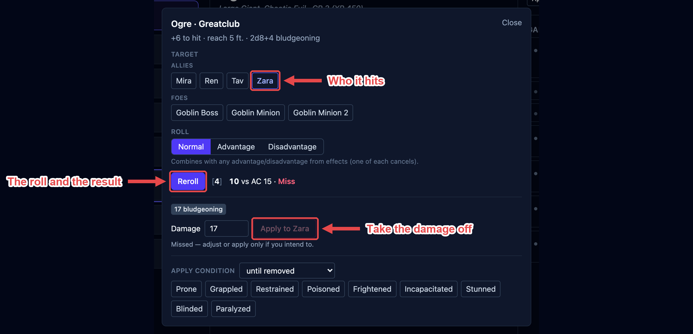
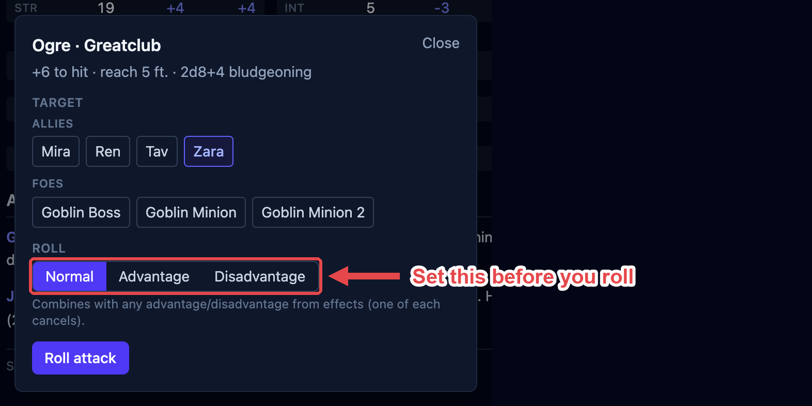
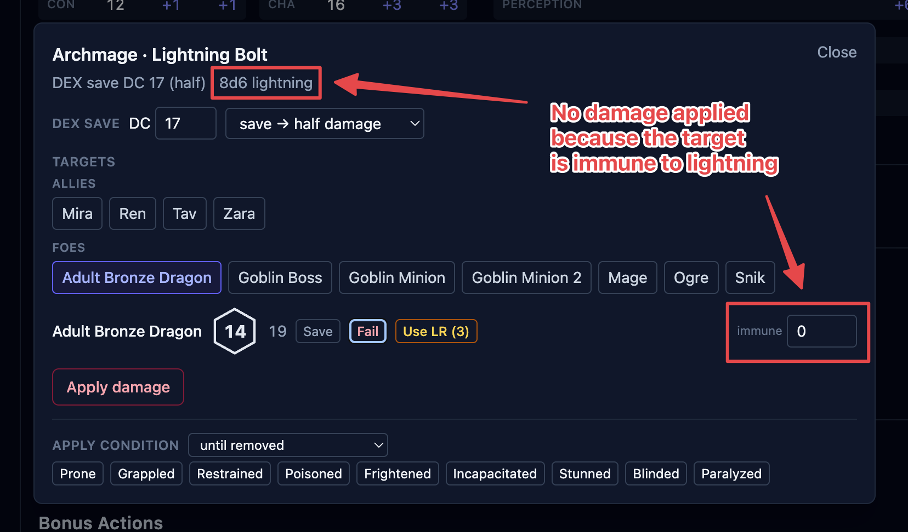

When a creature attacks, you roll it from its stat block and OpenFray does the rest: the
to-hit roll against the target's armor class, the damage, and any resistance or immunity
the target has. This page walks through one attack from start to finish.

:::note[Players roll their own attacks]
This is for the creatures OpenFray has the numbers for.
Players roll their own attacks, you enter the result if needed.
:::

## Rolling an attack

1. Click the attacking creature in the tracker to select it. Its stat block fills the
   middle column.
2. In the stat block, click the **name of the attack**, such as _Bite_, _Longsword_, _Fire
   Breath_. The attack box opens.
3. Pick the **Target** from the chips at the top.
4. Click **Roll attack**. OpenFray rolls a d20, adds the attack's bonus and any modifiers
   from [effects](/docs/fight/effects/), and shows the total against the target's armor
   class: **Hit** or **Miss**.

**Roll attack** becomes **Reroll** after the first roll, so you can roll again if you need
to.

The video below shows a full attack flow, from clicking the action to applying the damage:

<video controls preload="none" poster="/docs/videos/attack-resolution.jpg" width="1440" height="726" style="max-width:100%; height:auto; border-radius:0.6rem;">
  <source src="/docs/videos/attack-resolution.mp4" type="video/mp4" />
</video>

### Advantage and disadvantage

Above the roll button, the **Roll** setting is **Normal**, **Advantage**, or
**Disadvantage**. Set it before you roll.

This combines with any advantage or disadvantage already on the board from
[effects](/docs/fight/effects/) — one of each cancels out. So if the target has an effect
that grants attackers advantage (e.g. a barbarian's _Reckless Attack_), you can leave this on **Normal** and still roll with
advantage.

## Critical hits

A natural 20 is a **Critical hit!** and a natural 1 is a **Critical miss!**. How much a crit
adds to the damage follows your campaign's [crit rule](/docs/library/campaigns/#house-rules).

A **melee** hit on a **Paralyzed** or **Unconscious** target is a critical automatically.
The box shows _(auto-crit, Paralyzed target)_ or _(auto-crit, Unconscious target)_ so you
know why.

## Damage

After a hit, OpenFray rolls the attack's damage and shows it as a pill for each damage type.

1. Check the **Damage** field. It's filled in with the rolled total, and you can edit it.
2. Click **Apply to _{target}_** to take the damage off the target's hit points.

Damage is never applied until you press that button. On a miss the button is dimmed; you
can still apply if you mean to (adjust the number first).

If the attack also lands a condition (a bite that grabs, a stinger that poisons) the box
offers to apply it to the target in the same step, including **+1 Exhaustion** for the
attacks that cost a level. See [Exhaustion](/docs/fight/effects/#exhaustion).

## Resistance, immunity, and vulnerability

OpenFray knows a creature's defenses from its stat block and works them into the damage for
you:

- **Resistance** halves the damage of that type, rounded down (e.g. `7` becomes `3`);
- **Immunity** takes it to zero;
- **Vulnerability** doubles it.

Each damage pill shows the type and the final amount, with a label like _resisted_ when a
defense changed it. This works for **players** too, as long as you've given the character
its defenses, in the **Add PC** form or on a saved [character](/docs/fight/combatants/#players).
If a player has none recorded, there's nothing to apply, so adjust the **Damage** field
yourself before applying.

## Casting an attack spell

An attack-roll spell (e.g. _Fire Bolt_, _Chromatic Orb_) uses this same box. Cast it from a
creature's stat block and its attack bonus is filled in. Cast it from **Cast spell**
without naming a caster (for a player's spell) and you type the **Spell attack bonus**
yourself. See [Spells](/docs/fight/spells/).
