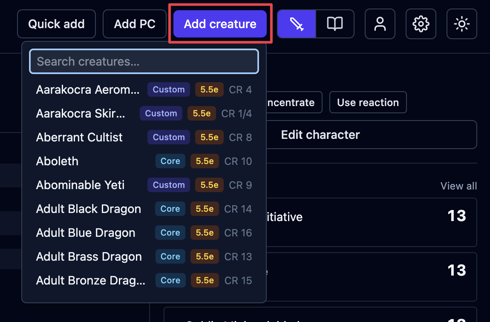
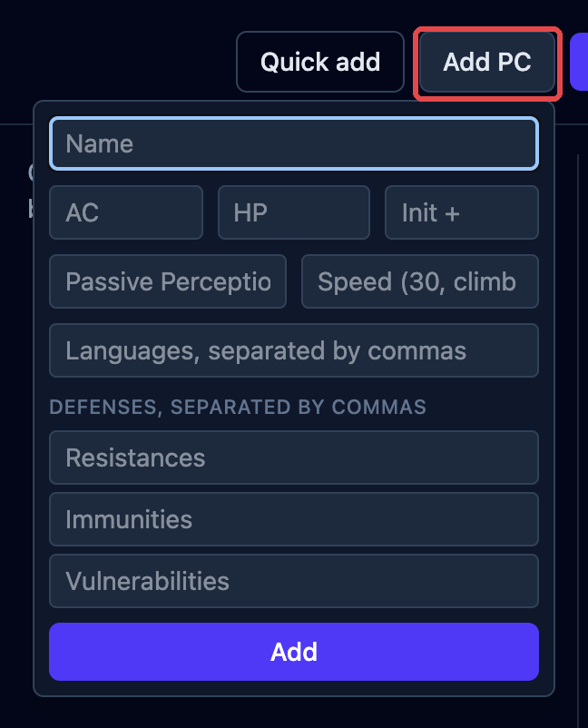
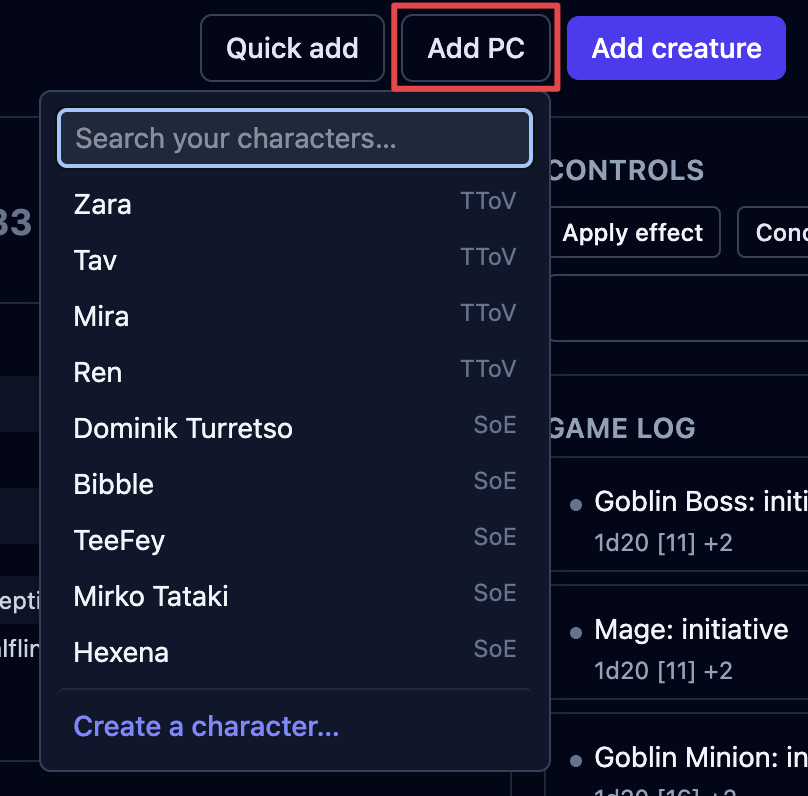
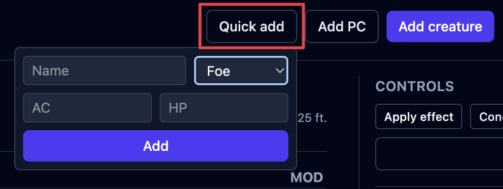
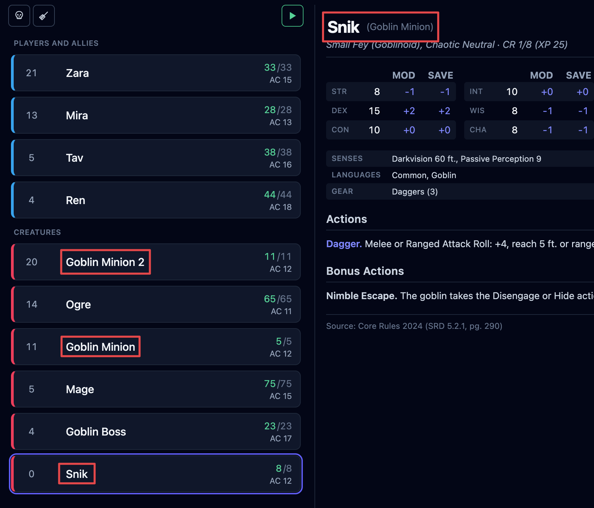

Every combatant in a fight is added in one of three ways. The difference is how much OpenFray
knows about them.

## The three kinds

### Creatures

Click **Add creature** to pick one from the [compendium](/docs/library/compendium/).

You get the whole creature: its abilities, attacks, reactions, legendary actions, and spells.
OpenFray rolls its dice for you, because it has all the numbers.

When you add a creature, OpenFray takes its own copy. Editing the creature in the library
later won't touch one already in a fight, and damage or spells used in a fight won't
change the library.

### Players

A player character sheet is intentionally simple — just what you, the Game
Master, need to see on the board:

- always: name, armor class, hit points, and conditions;
- optional: ability scores, senses, speed, damage the character resists or is immune
  to, languages, and notes.

OpenFray never automatically rolls for a player. Wherever it would roll for a creature,
you type in what the player rolled instead.

If you sign in with your Google or Discord account, you can save your player characters and
add them from the compendium instead:

### Throwaway combatants

**Quick add** drops in something you're inventing on the spot and won't reuse — just a
name, hit points, armor class, and whether it's a **Friend** or a **Foe**.

## What each row shows

Once a combatant is on the board, the tracker row shows their initiative, name, hit points,
and armor class, and you change hit points right there. See
[The tracker & rows](/docs/fight/tracker/).

## Copies and renaming

Add the same creature multiple times and a number is added to their name for you — that's just to
tell them apart. Its stat block still shows their original name. If you rename one
yourself, it shows its custom name with the real one after it (e.g. _Snik (Goblin)_), so you always
know what it actually is.

