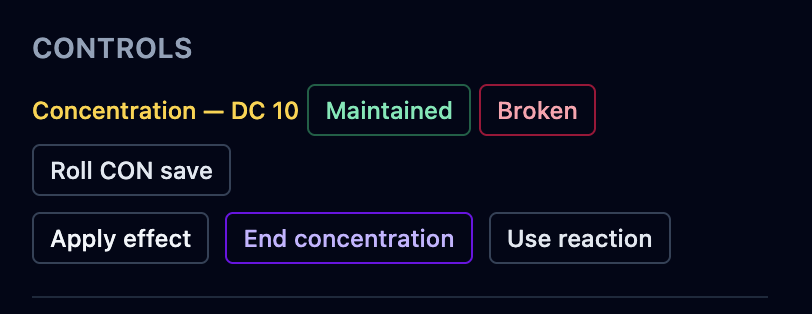

Some spells last only while their caster keeps **concentration** — and hold it until the
caster is distracted, drops it, or takes enough damage to break it. OpenFray tracks who is
concentrating on what, and clears the spell's effects everywhere the moment concentration
ends.

## Marking a creature as concentrating

In the controls beside a creature's stat block, click **Concentrate**. You can add the
spell's name and, if you like, how long it lasts. Casting a concentration spell from
[Cast spell](/docs/fight/spells/), or from a creature's stat block, starts this for you
with the timer already counting — as soon as the spell lands on someone. A spell every
target shrugs off leaves nothing to hold on to, so nobody is marked as concentrating.

## Ending concentration

Concentration is what keeps a spell going, so **ending it removes that spell's effects
from everyone at once**. Break the caster's concentration on _Bless_ and all three blessed
allies lose it together — you don't clear each one by hand.

Concentration also drops on its own when its timer runs out.

## The check after damage

When a creature that's concentrating takes damage, it has to make a Constitution save to
hold on. OpenFray works out the DC — **10, or half the damage taken, whichever is higher** —
and prompts you on the creature's row:

- **Maintained** — the save succeeded; concentration holds.
- **Broken** — the save failed; concentration ends, and the spell's effects clear.
- **Roll CON save** — for a creature, OpenFray rolls the save for you. A player rolls their
  own, and you tap **Maintained** or **Broken**.

Breaking concentration this way clears the spell's effects just like ending it by hand.

