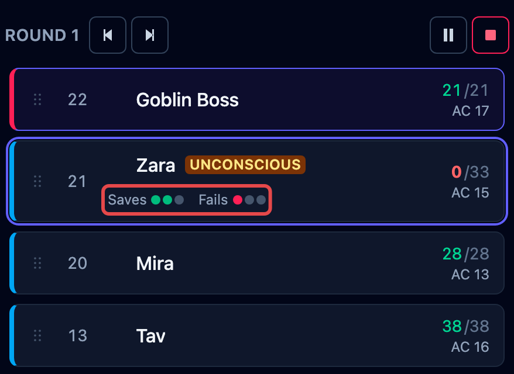
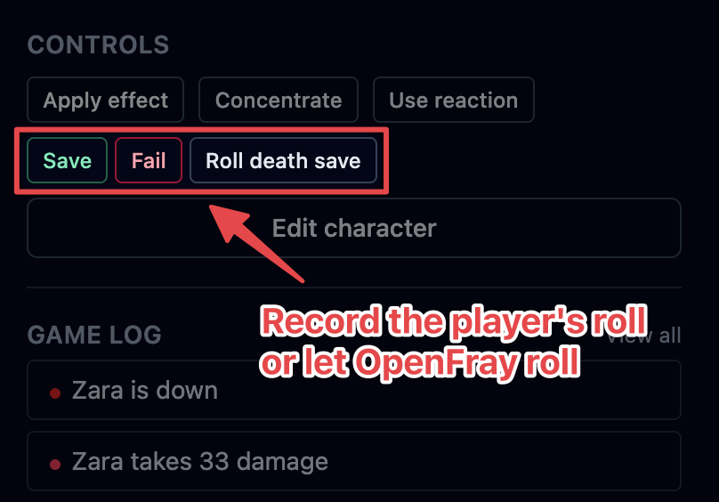
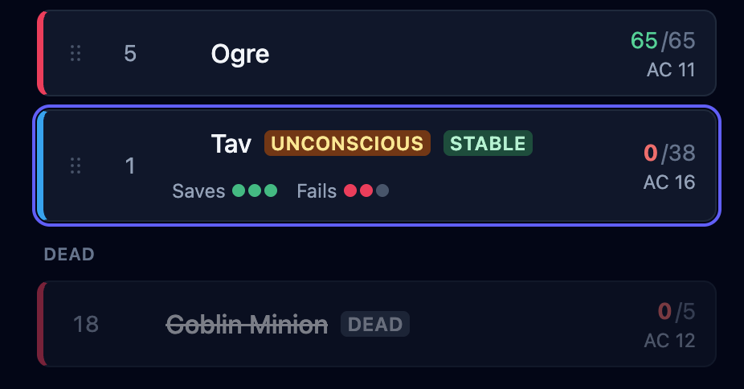

When a creature reaches 0 hit points it doesn't leave the fight. A foe is marked dead; a
player character drops unconscious and starts rolling death saves. This page covers both,
and how a downed character comes back.

## Down, dead, and back again

Every combatant is **active**, **unconscious**, or **dead**. Nothing is automatically deleted: a
downed or dead creature stays in the initiative order, grayed out and skipped, so it's
right there if it's brought back.

- A **creature** (a foe or a quick add) at 0 hit points is marked **dead**.
- A **player character** at 0 is marked **unconscious**, and OpenFray starts tracking their
  death saves.

Healing a character above 0 wakes them: their status goes back to active, the death-save
tally clears, and they keep their place in the order, without re-rolling initiative.

## Death saves

A downed player's row is tagged **Unconscious** and shows a set of pips: successes on one
line, failures on the other.

Select the character and their controls show three buttons.

- **Save** and **Fail** record what the player rolled. This is the normal path: the player
  rolls their own die, and you tap what happened.
- **Roll death save** is the fallback for when they can't roll. OpenFray rolls it and
  records the result for you.

Once the tally resolves, OpenFray stops asking. A stabilized character keeps a **Stable**
tag on their row; a dead one grays out in the tracker. Their original initiative stays unchanged.

## What OpenFray applies for you

Four things happen on their own during a fight, so nothing is missed mid-combat:

| When                               | OpenFray does this                                               |
| ---------------------------------- | ---------------------------------------------------------------- |
| A drying character receives damage | Records a failure with the damage                                |
| That damage came from a melee hit  | Records it as a critical, so two failures                        |
| **Roll death save** is a nat 20    | Puts them back on their feet at 1 hit point and clears the tally |
| **Roll death save** is a nat 1     | Records two failures                                             |

Damaging a **stable** character clears their successes before applying the failure, so the
row goes straight back to dying rather than staying stable.
