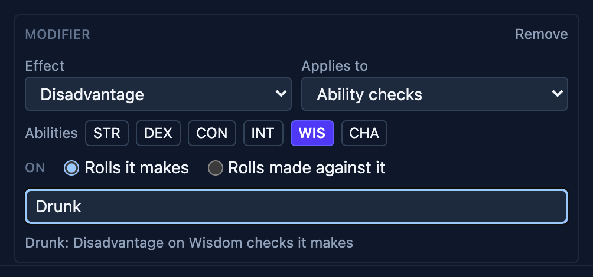
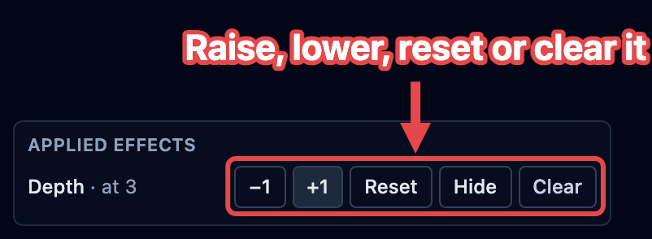

During a fight, little things pile up: this creature is frightened, that one has
advantage, someone is blessed. OpenFray keeps track of all of it. Every one of these is
an **effect**, and they all work the same way.

## The kinds of effect

Whatever spell or ability caused it, what lands on a creature is always one of these:

| Kind                                  | Examples                                             |
| ------------------------------------- | ---------------------------------------------------- |
| **A condition**                       | Prone, Frightened, Paralyzed, Poisoned               |
| **Attacks against it have advantage** | Faerie Fire, attacking a prone creature in melee     |
| **Its own rolls have disadvantage**   | Vicious Mockery, Bane                                |
| **A bonus or penalty to rolls**       | Bless (+1d4), Bane (−1d4), +10 to Stealth            |
| **A change to its numbers**           | +2 to armor class, Speed halved, −10 HP maximum      |
| **A reminder**                        | a note to yourself, like "Hex: +1d6 on a hit"        |
| **Ends on a save**                    | something a saving throw shakes off                  |
| **A counter**                         | a tally you raise and lower, like a corruption track |
| **A level of Exhaustion**             | 1 to 6, with the penalties each level brings         |

Conditions are just one kind of effect, so there's only one thing to learn. You tell
OpenFray what happened; it remembers it and works it into the right rolls and numbers.

## Adding an effect

Click the creature in the tracker, then click **Apply effect** in the controls beside its
stat block. The box stages everything you pick — nothing lands on the creature until you
press **Apply**, so you can build the whole thing and change your mind on the way.

**1. Start from a preset, if one fits.** **Presets**, at the top of the box, opens a
search over the ready-made bundles — yours and the ones your
[libraries](/docs/reference/settings/#libraries) ship. Picking one fills the form below,
replacing whatever was staged, and you can adjust any part of it before applying. The
row appears once there are presets to offer; see [Presets](#presets).

**2. Set how long it lasts.** This applies to everything staged in the box:

| Choice                      | Use it for                                                                                                                                                  |
| --------------------------- | ----------------------------------------------------------------------------------------------------------------------------------------------------------- |
| **Until removed**           | you'll clear it yourself when the story says so                                                                                                             |
| **This turn / next attack** | something used up by the next roll (Vicious Mockery)                                                                                                        |
| **Save ends**               | something the creature can shake off — it then asks which save, the number to beat, and whether it's rolled at the start or the end of that creature's turn |
| **1 round** … **24 hours**  | anything with a stated duration — a spell, a potion                                                                                                         |
| **Custom…**                 | any other length, typed as a number of rounds, minutes, hours, or days                                                                                      |

**3. Set a reminder.** Type a short note. OpenFray shows it on the creature's tracker row
and reminds you; you decide what it does. **+ Add another reminder** stages a second note.

**4. Apply a condition.** These are toggles: the ones already on the creature are
highlighted, and tapping one again takes it off.

**5. Set an Exhaustion level.** Exhaustion isn't a toggle — it's a number from 1 to 6.
Click the level, and the line below spells out what it does before you apply it. **None**
takes the condition off. See [Exhaustion](#exhaustion).

**6. Add a counter.** Click **+ Add counter** and name it — a tally you raise and lower
by hand, like a corruption track or a countdown. Tick **Hidden from players** to keep its
number off the shared [player view](/docs/fight/player-view/). See [Counters](#counters).

**7. Add a bonus or penalty.** Click **+ Add a bonus or penalty** and pick _what_ it does
(Advantage, Disadvantage, or a number), _what it applies to_, and _whose rolls_ (the
creature's own, or rolls made against it). It can apply to a kind of roll — attack rolls,
saving throws, ability checks, or everything — or to one of the creature's numbers:
armor class, Speed, or the HP maximum. A modifier on saving throws or ability checks can
be narrowed to particular abilities, so "Disadvantage on Wisdom checks" reaches only
those. Give it a label, like Bless or Reckless, so you recognize it on the board later.
OpenFray spells out what you've built in plain English.

**8. Name the bundle.** With two or more parts staged, **Apply as one** offers a name —
_Drunk_, _Cursed_. Named, everything above lands as one badge that clears together; left
blank, each part gets its own badge. A counter always stands alone, so its tally outlives
whatever applied it, and so does an Exhaustion level.

**9. Apply.** Click **Apply** to add everything staged to the combatant — or
**Save as preset** first, to keep the bundle for the next time. See [Presets](#presets).

### The numbers a modifier can move

A modifier aimed at armor class, Speed, or the HP maximum changes the number itself: the
stat block and the tracker row show the changed value for as long as the effect lasts,
and rolls and damage use it. A Speed amount can be a number (`-10`), or `half`, `zero`,
or `double`. When an effect lowers the HP maximum below the creature's current hit
points, the current hit points drop to match — and they don't spring back when the
effect ends, the same way a cured disease doesn't heal the flesh it cost.

### Two examples

#### Reckless Attack

The barbarian's player announces it. There's no spell to cast and nothing on any stat
block — but for the rest of the round, attacks against them land more easily, and that's
the sort of thing you'll otherwise forget by the time the enemy swings.

1. Click the player's character, then **Apply effect**.
2. Set **Duration** to **1 round**, so it clears itself when their turn comes round again.
3. Click **+ Add a bonus or penalty**.
4. Set the **Effect** to **Advantage**, **Applies to** to **Attack rolls**, and **On** to
   **Rolls made against it**.
5. Set the label to **Reckless attack**, so the badge on their row says why.
6. Click **Apply**.

Now when a creature swings at them, OpenFray rolls with advantage on its own, shows both
dice, and names _Reckless attack_ as the reason.

#### Something you just made up

A creature throws a flask of oil on a player and they are now covered in oil. There's no
condition for that and no spell involved — you just don't want to forget it two rounds
from now.

1. Click the player, then **Apply effect**.
2. Set **Duration** to **Until removed**, because it ends when the story says so.
3. Type the note in **Reminder** and press **Apply**.

It becomes a badge on their row like any other effect. OpenFray shows the reminder and
keeps it in front of you until you clear it, but it doesn't apply any effect for you — a
reminder is a note, and you decide what it means.

## Presets

A preset is a bundle you apply more than once — _Drunk_, a disease stage, a house rule.
Open **Apply effect** and click **Presets** to search them; picking one fills the form,
and nothing lands until you press **Apply**, so a preset is a starting point rather than
a button.

Presets come from two places:

- **Your own.** Stage the parts once, then click **Save as preset** and name it. It's
  kept in your library and offered in every fight.
- **A library's.** Turning a library on in
  [Settings](/docs/reference/settings/#libraries) adds the presets it ships:
  _Brood & Bloom_ carries its disease stages and brood counters, and _On Strong Waters
  and Potent Simples_ carries Intoxication, Craving, and the degrees of addiction.

A preset can carry a change in Exhaustion too — see
[Exhaustion in a preset](#exhaustion-in-a-preset).

Read any preset in full on the compendium's **Effects** tab — see
[The compendium](/docs/library/compendium/#effects).

:::note[Needs an account]
Saving your own presets requires signing in with a free Google or Discord account. A
library's presets work for everyone who has the library turned on.
:::

## Where effects show up

Each effect shows as a small **badge** under the combatant's name in the tracker — just
the name, so the row stays easy to read at a glance. Parts applied as one named bundle
share a single badge carrying the bundle's name; point at it to read what's inside.

The details live in the **Applied effects** list, in the controls beside the stat block.
A bundle appears under its own name with its parts listed beneath it and one **Clear
all** for the lot; every effect keeps its own buttons:

- **Clear** removes it.
- For an effect that ends on a save, **Roll save** rolls it, and the line shows the
  ability and number needed.
- **Hide** keeps that one effect off the shared [player view](/docs/fight/player-view/);
  a hidden effect is tagged **Hidden**, and clicking again shows it.
- **Clear effects** removes all the applied effects at once.

Casting a spell can put effects on the board too, already bundled under the spell's
name — see [Spells](/docs/fight/spells/).

## How long effects last

Every effect knows when it ends, and the **Applied effects** list tells you:

- effects that last a number of **rounds** count down and show what's left ("10 rounds
  left"); if it's more than about ten minutes, it shows the time instead ("1 hour
  left");
- **ends on a save** shows the ability and number, like `WIS save DC 15 (EoT)`;
- some clear the next time the creature rolls (Vicious Mockery);
- some clear when the creature that caused them takes its next turn;
- the rest stay until you clear them, and keep the spell's own wording where OpenFray
  can't count it down ("8 hours").

### Effects a saving throw ends

Some effects hang on until the creature makes a saving throw — a paralysis, an ongoing
burn. Each one gets **its own** save: two effects that happen to need the same save and
DC still roll separately. On a creature's turn, OpenFray rolls these for you, at the
start or end of the turn as you chose. For a player, use **Roll save** to record their
roll, or just **Clear** it when they pass.

When the effect is part of a bundle, succeeding on its save clears the whole bundle —
the save ends the spell, not one line of it.

## Exhaustion

Exhaustion is the one condition that isn't on or off. It's a level from 1 to 6, and each
level costs the creature more. OpenFray holds the level and works its penalties into the
rolls and numbers, the same way it works in any other effect.

To set it:

1. Click the creature, then **Apply effect**.
2. Under **Exhaustion**, click the level — or **None** to take it off.
3. Read the line below the levels. It says what that level does before you commit to it.
4. Click **Apply**.

The creature's row shows one badge reading **Exhaustion 3**, and the **Applied effects**
list beside the stat block lists what the level landed. Its buttons sit on the badge's
header line, not on the parts:

| Button        | What it does                                               |
| ------------- | ---------------------------------------------------------- |
| **+1**        | Raises the level by one. It stops at 6.                    |
| **−1**        | Lowers it by one. At 0 the condition ends.                 |
| **Clear all** | Takes Exhaustion off entirely, with everything it applied. |

The parts underneath have no buttons of their own. They're what the level means, so
changing one alone would only put it out of step with the number.

### What a level does

Which penalties a level brings depends on which rules your campaign plays, so OpenFray
reads that from the campaign you're running (see
[Campaigns & house rules](/docs/library/campaigns/)). Without a campaign it uses the 2024
rules.

- **Basic Rules 2024** — every d20 roll the creature makes drops by 2 for each level, and
  its Speed drops by 5 feet for each level. At level 3 that's -6 and -15 feet.
- **Basic Rules 2014** — each level adds a new penalty on top of the ones below it:
  Disadvantage on ability checks at 1, Speed halved at 2, Disadvantage on attack rolls
  and saving throws at 3, the hit point maximum halved at 4, and Speed 0 at 5.

Switching a campaign doesn't rewrite a level already on the board. Set the level again
and OpenFray rebuilds it for the rules you're playing now.

:::caution[Level 6 is yours to apply]
A creature at level 6 dies. OpenFray shows that as a reminder and does nothing else — it
never kills a creature for reaching a number, and it never removes a level at a long rest
either. Both are your call.
:::

### Exhaustion in a preset

Exhaustion is cumulative, so a [preset](#presets) carrying it **adds levels** rather than
setting one. Save a preset while the level is staged and it keeps the change you just made:
stage 3 on a character already at 1 and the preset is worth two levels. Apply it to someone
at 0 and they end at 2; apply it to someone at 4 and they end at 6.

The preset's card on the compendium's **Effects** tab says which, as _Gains 2 levels_. A
preset can relieve Exhaustion the same way — lower the level before you save it, and the
card reads _Removes 1 level_.

## Counters

Some things at the table are a number that goes up and down rather than something that
ends: a homebrew corruption track, a countdown you're running. A **counter** is an effect
that holds that number for you. OpenFray never changes it — you do, and you decide what it
means when it gets high.

To add one:

1. Click the creature, then **Apply effect**.
2. Click **+ Add counter**.
3. Type its name — something like `Depth` or `Corruption` — and tick
   **Hidden from players** if the table shouldn't read it.
4. Click **Apply**.

It starts at 0. The counter shows on the creature's row as a badge with its number in it,
so you can read it at a glance. In the **Applied effects** list beside the stat block, it
gets buttons of its own:

| Button    | What it does                                        |
| --------- | --------------------------------------------------- |
| **+1**    | Raises the number by one.                           |
| **−1**    | Lowers it by one. It never goes below 0.            |
| **Reset** | Puts it back to 0, and leaves the counter on.       |
| **Clear** | Removes the counter, the way it removes any effect. |

Every change is written into the [game log](/docs/reference/game-log/), so you can retrace
how a number got where it is.

:::note[Nothing counts it for you]
A counter isn't a timer. It doesn't tick down at the end of a turn, it survives a long
rest, and reaching any particular number does nothing on its own. It's a number OpenFray
holds so you don't have to.
:::

## Concentration

A spell that a creature has to concentrate on is a special case: ending the concentration
clears the spell's effects everywhere at once. That has its own page —
[Concentration](/docs/fight/concentration/).
