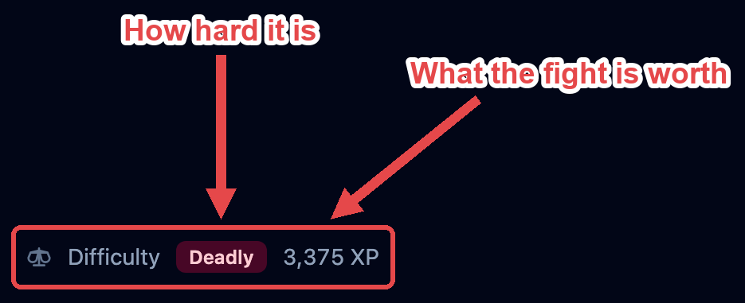
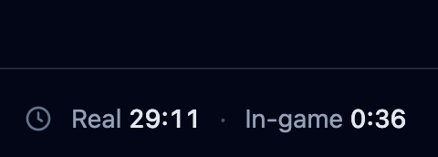
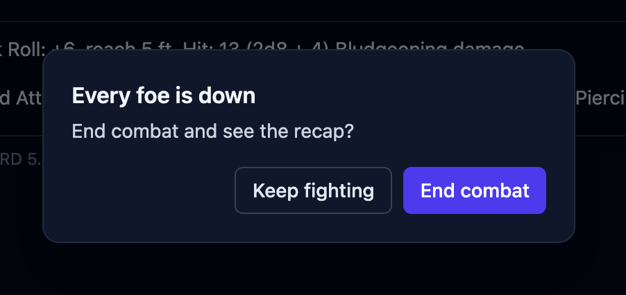

An **encounter** is the fight you're running: everyone in it, the initiative order, and
which round you're on. The left column, the **tracker**, is where it all happens.

## Setting the order

Add everyone before the fight starts (see [Getting started](/docs/getting-started/)).
Until you begin, players and foes sit in separate groups so you can see both sides.

Click **Begin** and OpenFray asks for everyone's initiative. Creatures are rolled for
you. Players are blank, so you can type what they rolled, or leave it blank and let
OpenFray roll. You can also mark someone **surprised** here. What that does depends on
your campaign's [surprise rule](/docs/library/campaigns/#house-rules).

Click **Start combat** and you're in round 1, at the top of the list.

## How hard the fight looks

While you're filling the board, the left of the footer rates the fight in front of you:
**Trivial**, **Easy**, **Medium**, **Hard**, or **Deadly**, with the experience points it
adds up to. It changes every time you add or remove someone, so you can drop in one more
foe and watch it move.

The rating is an estimate, and it's worth knowing what it's built from:

- **Your players set the bar.** OpenFray doesn't know anyone's level. It works it out
  from their hit points, and from Constitution when the character has it recorded. Give a
  saved [character](/docs/fight/combatants/#players) its ability scores and the estimate
  gets closer.
- **Numbers count for more than they look.** Six foes are harder than one foe worth the
  same experience, so the total is scaled up for a crowd, and again for a party of one or
  two.
- **A quick add is guessed at.** Something you invented on the spot carries no experience
  value, so OpenFray sizes it up from its hit points and armor class. It's a rough figure.
- **The dead don't count.** Foes left on the board from the last fight are ignored.

Once the fight starts, the [clocks](#rounds-and-turns) take that spot. The rating is kept
and shown again in the [end-of-fight summary](/docs/fight/recap/).

## Rounds and turns

The creature whose turn it is glows in the tracker, and its stat block fills the middle
of the screen. The buttons beside the round number move the fight along.

:::caution[Going back is a fix, not an undo]
**Previous turn** moves the marker back and nothing else. It does **not** put things
back the way they were: timers that counted down, a used reaction, or lost
concentration all stay as they are. Use it when you clicked ahead by mistake, not to
replay a turn.
:::

**Pause** holds the fight while the session stops. The turn marker disappears so nobody is
"up", and the footer timers stop counting. Press it again to carry on where you left off.
For example, when a creature is willing to negotiate with the players pause the fight while
they talk. Resume it if things go south.

**Stop** ends the fight. Everyone stays on the board with their hit points, effects, and
conditions intact; the round counter resets and the **Begin** button comes back. Nothing is lost,
so stopping by mistake is safe.

Two clocks run in the footer while you fight: **Real**, the time you've actually spent
(pauses don't count), and **In-game**, six seconds per round. Use the in-game clock to
tell a player how long a timed spell has left.

### Moving to the next turn

Clicking **Next turn** does more than move the marker. Each time, OpenFray:

- counts down effects that last a set number of rounds, and removes the ones that run
  out;
- gives the creature back its reaction, and refreshes its legendary actions;
- clears effects that last "until my next turn" as their owner starts to act;
- counts down concentration and drops it when it runs out;
- rolls a creature's [saves to shake off an effect](/docs/fight/effects/#effects-a-saving-throw-ends)
  at the right moment in its turn;
- rolls to see whether a used-up recharge ability is available again (e.g. a dragon's breath attack).

OpenFray follows whose turn it is by the creature itself, not by its place in the list,
so adding, removing, or dragging creatures around never loses the turn.

## Rearranging the order

Sometimes the order needs a nudge. Someone held their action, or you typed a number
wrong. Once the fight is running, every living row shows a **drag handle**: the six small
dots on the far left of the row, before the initiative number.

Drag that handle up or down to move the combatant. Its initiative changes to fit its new
spot, and nobody else's number moves. Combatants that are down or dead stay in the list,
grayed out and skipped, so the order holds steady if they come back.

## Ending the fight

When the last foe is defeated, OpenFray asks once whether the fight is over.

Click **Keep fighting** to keep the fight active (e.g. if a second wave of foes is coming or a player is rolling death saves);
Click **End combat** to stop the fight and get its summary: the outcome, experience, timings, and a few standout hits. See
[End of the fight](/docs/fight/recap/).
