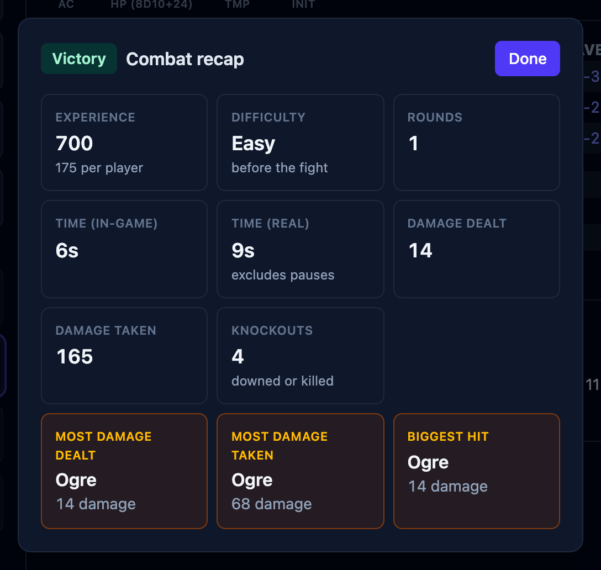

When a fight ends, OpenFray shows a summary of how it went: who won, the experience points
earned, how long it took, and a few standout numbers. This page covers what the summary
shows and when it appears.

## When the summary appears

The summary comes up three ways:

- when you confirm the prompt after the **last foe is defeated**;
- when you press **Stop** to end the fight;
- when the **whole party goes down**.

A party wipe only counts once every player is dead or stable. One character still rolling
[death saves](/docs/fight/death/) means the fight is still on.

## What it shows

- **The outcome** — victory, defeat, or simply ended.
- **The difficulty** it was rated at before it began. See
  [Encounters & initiative](/docs/fight/encounters/#how-hard-the-fight-looks). Worth
  comparing against how it actually went.
- **Experience earned**, and what that works out to per player, unless your campaign levels
  up by [milestone](/docs/library/campaigns/#leveling-up-experience-or-milestone), in which
  case experience is left out. Only foes pay: a creature
  [fighting for the party](/docs/fight/combatants/#allies) that went down isn't an encounter
  they overcame.
- **How long it took** — rounds, in-game minutes (six seconds a round), and real time with
  pauses excluded.
- **Total damage** dealt and taken.
- **Three awards** — most damage dealt, most damage taken, and the biggest single hit.

## Your players see it too

If you're sharing a [player view](/docs/fight/player-view/), the same summary appears on your
players' screens for as long as you leave it open, and their log clears at the same moment,
ready for the next fight. Both are settings. See
[Choosing what they see](/docs/fight/player-view/#choosing-what-they-see).

Pressing **Stop** keeps everyone on the board, so you can look the summary over and carry
on. To take the board apart for the next fight, see
[Rests & clearing the board](/docs/fight/rests/#clearing-the-board).
