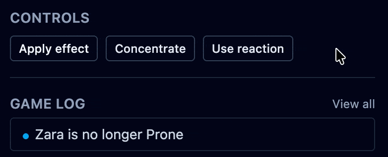
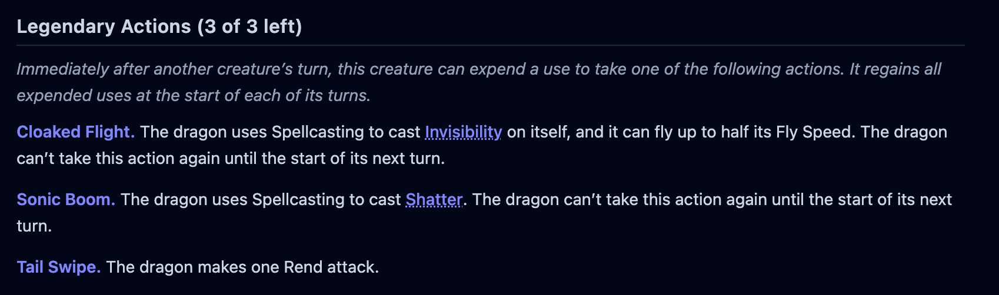
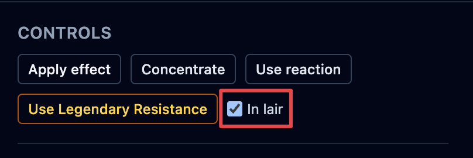
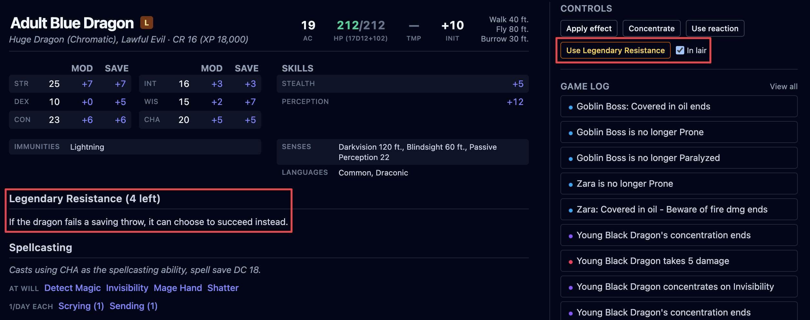
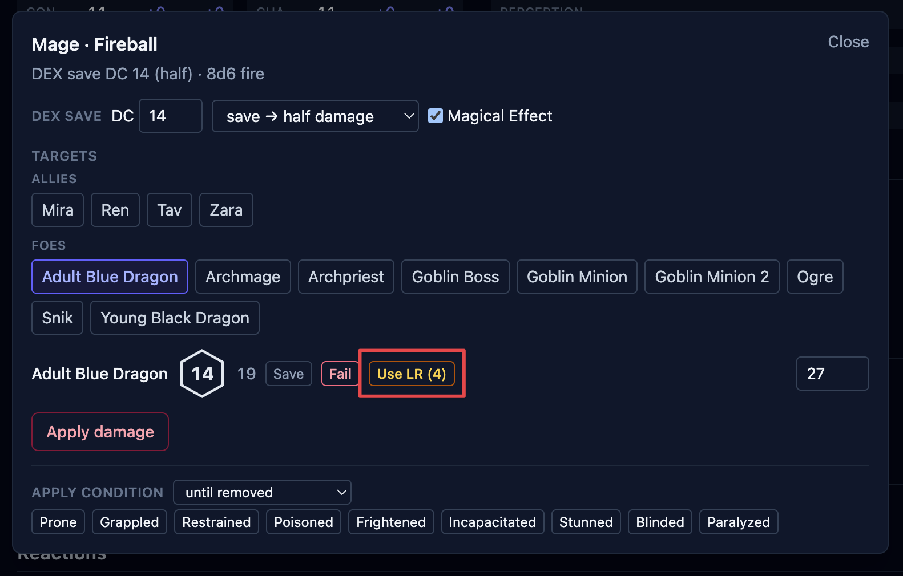
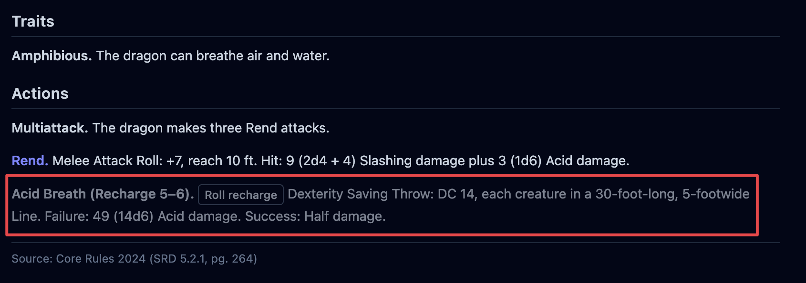

Creatures come with resources that run down over a fight: a reaction each round, legendary
actions, legendary resistance, recharge abilities, limited-use actions, and spell uses.
OpenFray tracks each one as you spend it, and refreshes what should come back on the
creature's turn. You spend them from the creature's controls and from its stat block.

## Reactions

Every creature gets one reaction a round — an opportunity attack, a readied action, a
_Shield_ spell. In the controls beside the stat block, click **Use reaction** when it
spends one; the button changes to **Reaction used**.

A creature's own reactions are in the **Reactions** section of its stat block. Click one to
spend the round's reaction with it — the **Use reaction** control changes to **Reaction
used** either way. If the reaction rolls something, the [attack](/docs/fight/attacks/) or
[save](/docs/fight/saves/) box opens; most reactions (_Parry_, _Split_) roll nothing and
just spend it.

The reaction refreshes at the **start of that creature's next turn**, so you don't have to
reset it by hand, although you can if you used it by mistake.

## Legendary actions

A legendary creature can act between other creatures' turns. Its stat block has a
**Legendary Actions** section, headed with how many it has this round — for example,
_Legendary Actions (3 of 3 left)_.

Click a legendary action to spend it. Each one has a cost, and the header counts down as
you spend from the round's budget. If the action rolls something — an attack, a save — it
opens the [attack](/docs/fight/attacks/) or [save](/docs/fight/saves/) box. The budget
refreshes at the start of the creature's turn.

A creature with legendary actions has a larger budget **in its lair**; The **In lair** toggle marks the creature as fighting in its lair. It swaps to the lair
counts for legendary resistance and legendary actions, which are often higher there.

## Legendary resistance

A creature with **Legendary Resistance** can turn a failed saving throw into a success a few
times a day. Its stat block shows the section with a counter — _Legendary Resistance (3
left)_ — and the controls have a **Use Legendary Resistance** button.

You can spend it two ways: press **Use Legendary Resistance** directly, or, when the
creature fails a save in the [save box](/docs/fight/saves/#turning-a-failed-save-into-a-success),
convert that failure to a success there. Either way spends one use.

## Recharge abilities

Some abilities — a breath weapon, a bite — come back on a die roll, shown as **Recharge
5–6** on the stat block. Use it and it grays out, spent. On the creature's next turn,
OpenFray rolls to see whether it recharges, and makes it available again if it does.

## Limited-use actions and spells

Other resources are counted per use:

- An action marked **N/Day** (a limited-use ability) is clickable while it has uses left and
  grays out at zero.
- **Spell uses** work the same way. An **At will** spell is unlimited; a **2/Day Each**
  block counts down per spell — casting _Fireball_ leaves _Invisibility_ untouched — and
  the spell grays out when it's spent. See [Spells](/docs/fight/spells/).

Moving to the [next turn](/docs/fight/encounters/#what-moving-to-the-next-turn-does)
refreshes what should return: the reaction, the legendary-action budget, and recharge
abilities. Per-day uses don't return until a rest, or until you re-add the creature.
