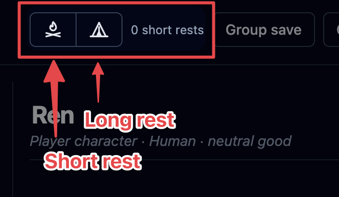
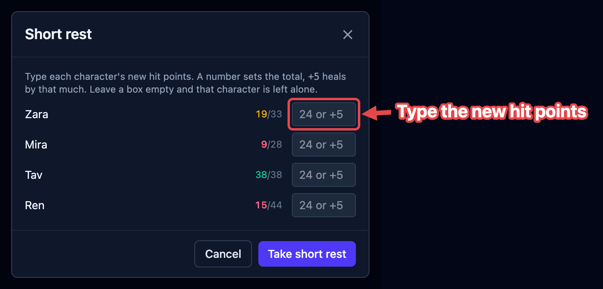

Fights don't happen back to back. Between them the party rests, and you clear the board
for whatever comes next. Both rests live in the top bar, to the left of **Group save** —
a campfire and a tent.

Rests are **disabled while a fight is running** — you can't rest mid-combat, so OpenFray
grays them out until you stop.

## Short rest

Click the **campfire**. OpenFray doesn't guess how much anyone recovers — it asks you,
because the players are the ones deciding. You get a list of everyone friendly, each with
a box:

In each box you can:

- type a **number** to set that character's hit points outright — "I'm on 24 now", or
- type **`+7`** to add that much to what they have.

Leave a box empty and that character is left alone. Nobody is healed unless you say so,
and current hit points are tinted by how hurt each one is, so you can see at a glance who
still needs attention.

If you're signed in, OpenFray also counts how many short rests the party has taken since
their last long rest, and shows it next to the button — handy for abilities that come
back "on a short rest" and for knowing when the day has gone on long enough.

## Long rest

Click the **tent**, and confirm. Unlike a short rest this one needs no input — OpenFray
applies the lot to every friendly creature:

- hit points go back to **full**;
- **concentration ends**;
- effects set to last **less than eight hours** are cleared — the 1-minute spell, the
  10-round buff;
- effects of **eight hours or more**, and anything set to _Until removed_, are kept.
  Those are the ones you're deliberately holding on to, so OpenFray leaves them be;
- the short-rest counter resets.

Foes are untouched.

## Clearing the board

When a fight is over and you're setting up the next one, two buttons at the top of the
tracker sweep it for you. They only appear **out of combat**, so neither can go off
mid-fight:

- the **broom** removes every foe and keeps your players, which is what you want between
  two fights in the same session;
- the **skull** removes _everyone_ and starts fresh — it also clears the game log, so use
  it when you're done with that story entirely.

Both ask before they do it.

:::note[Stop is not the same as clearing]
**Stop** ends the fight but keeps everyone on the board, with their hit points and
effects intact — it's for "the fight is over, hold on a moment". The broom and the skull
are for taking the board apart. See
[Encounters & initiative](/docs/fight/encounters/#rounds-and-turns).
:::
