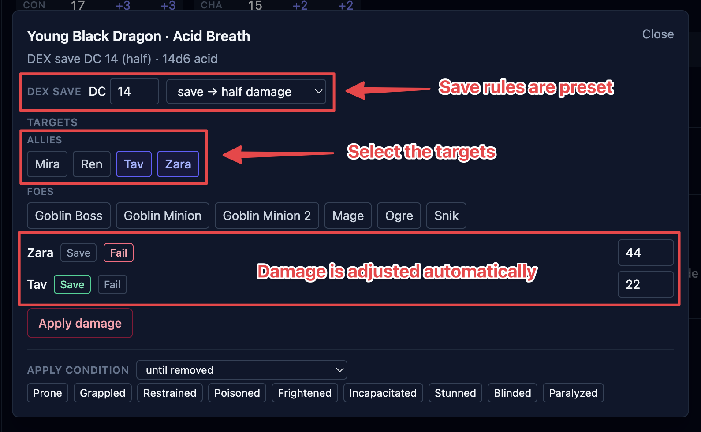

Saving throws come up two ways: an action forces one (a dragon's breath, a creature's
stinger), or a spell makes a whole group roll at once (the Fireball case). Both use the
same box. OpenFray rolls for the creatures, works in their save bonuses, and applies the
damage; players roll their own and you record the result.

## A save forced by an action

1. Select the creature and click the **action** in its stat block. The save box opens.
2. It's already set up from the stat block: the **ability** and the **DC** are filled in,
   and so is the **on-save** rule — **save → half damage**, **save → no damage**, or
   **save → negates effect**.
3. Pick the **targets** — your players and the foes are listed separately.
4. Type the **damage** — a formula like `8d6`, or a flat number.
5. Click **Roll saves**. OpenFray rolls each creature's save; for a player, you record
   what they rolled.

<!-- TODO screenshot: save-resolve.png — the save box resolving an action against several targets, mixed pass/fail. Highlight: DC, the Magical Effect / Evasion toggles, the per-target results, Apply damage. -->

<!--  -->

If the action deals damage with no save at all, the box says **Automatic area damage — no
save** and the button reads **Roll damage** instead.

## Magic Resistance and Evasion

Two common defenses are handled for you when they apply:

- **Magical Effect** — a creature with Magic Resistance rolls with advantage against spells
  and other magical effects. The **Magical Effect** toggle marks the save as magical; it's
  pre-checked when a spell forces the save.
- **Evasion** — a creature with Evasion takes no damage on a success and half on a failure,
  instead of the usual half-on-success. OpenFray shows an **Evasion** marker on those
  creatures and works it into the damage.

## Turning a failed save into a success

A creature with **Legendary Resistance** can choose to succeed on a save it failed. When a
creature that has uses left fails, the box offers to **turn the failed save into a
success** — one tap spends a use. See
[Creature resources](/docs/fight/resources/#legendary-resistance).

## Applying the result

Once the saves are rolled:

- Click **Apply damage** to take the damage off everyone at once — full, half, or none per
  creature, following the on-save rule and any Evasion.
- For a save-or-be-affected spell, the box also offers to drop the condition (or the
  spell's effect) on just the creatures that **failed**.

## Group saves

**Group save** is the standalone version — one spell, a whole group rolling against it at
once, with no action to start from. Open it from the top of the screen, or let a saving
throw spell open it for you.

1. Pick the **ability** and the **DC**, and what a successful save earns — half damage, no
   damage, or the effect simply doesn't happen. Casting a spell fills all of this in.
2. Choose who's rolling. Your players and the foes are listed separately.
3. Type the **damage** — a formula like `8d6`, or a flat number if the player already
   rolled it.
4. Click **Roll saves**. OpenFray rolls for the creatures, working in their save bonuses
   and things like Magic Resistance and Evasion. For your players, you type what they
   rolled.
5. **Apply damage** to everyone in one click — and for a save-or-be-affected spell, drop
   the condition on the ones that failed.

Casting a saving throw spell opens this box already filled in. See
[Spells](/docs/fight/spells/).
