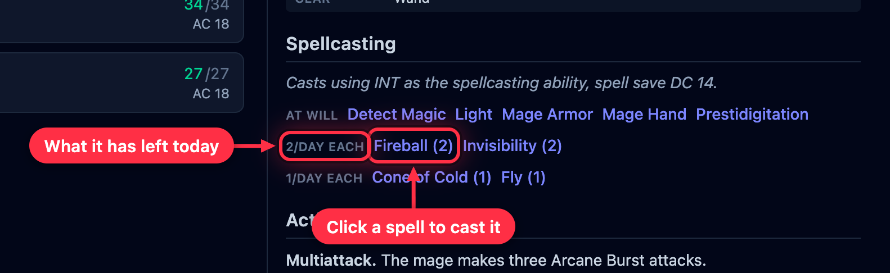
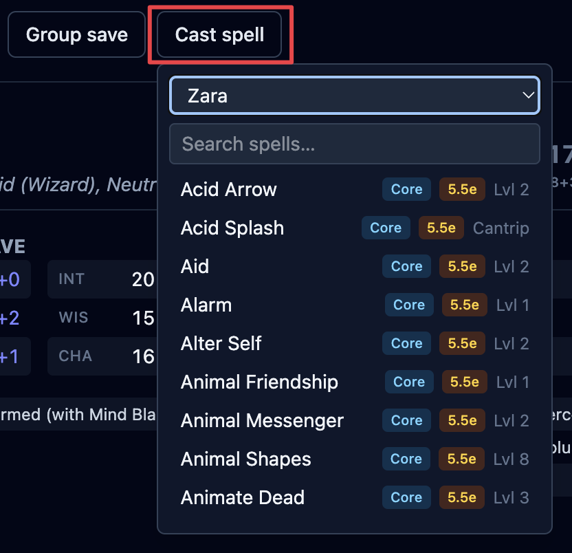
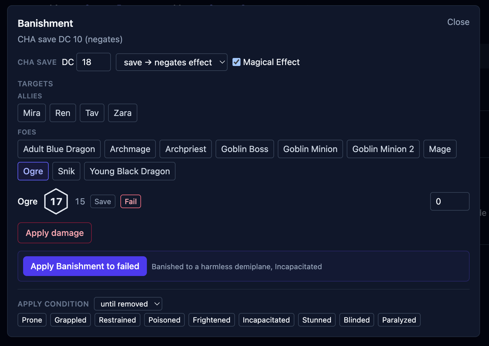
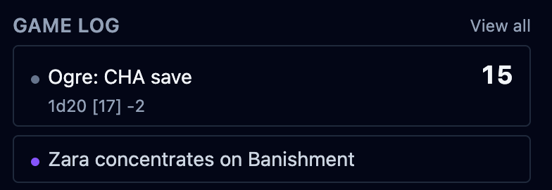

Casting a spell in OpenFray rolls its dice, offers to put its effect on the board, and
shows you its card so you can read what it does. This page covers casting from a creature
or from the **Cast spell** button, adding a spell's effect, and rolling a group's save.

## Casting a spell

There are two ways to cast.

**From a creature.** Open its stat block and click a spell in its list. OpenFray fills in
the save DC and attack bonus from that creature, and spends one casting: an _At will_
spell is unlimited, while a _2/Day Each_ spell counts down per spell — burning a Fireball
leaves its Invisibility untouched — and grays out when it's spent.

Creature spells cast at the level printed on the stat block. There's no upcasting to
pick, because a stat block doesn't have spell slots to spend.

**From the Cast spell button**, at the top of the screen. Search any spell — every spell
in the [libraries you've turned on](/docs/reference/settings/#libraries), plus your own —
then pick **who is casting it**.

Naming a caster is worth doing: OpenFray takes their save DC and spell attack bonus, and
if the spell needs concentration it starts the caster concentrating, with the timer
already counting. Leave the caster blank and you can still cast — you just type the
numbers yourself. That's the path for a player's spell, where OpenFray has no sheet to
read from.

What happens next depends on the spell:

- an **attack** spell opens the attack box — roll to hit, then deal damage;
- a **saving throw** spell opens the [group save](#group-saves) box, already filled in;
- a **helpful or utility** spell shows its card.

Wherever a spell rolls its own dice, **Roll damage** becomes **Reroll damage** afterwards.
Rerolling updates the damage the saves are split from and leaves the results you've already
recorded alone. See [Rerolling one creature's save](/docs/fight/saves/#rerolling-one-creatures-save).

## Putting a spell's effect on the board

Lots of spells leave something behind on a creature — a bonus, a condition, a note. When
a spell has one of those, OpenFray offers to **add it to the board** after you cast, so
you don't have to build it by hand:

- **Bless** → +1d4 on attacks and saves, for the creatures you pick;
- **Fly** → a _Fly Speed 60_ reminder;
- **Hold Person** → Paralyzed, with the saving throw already set up;
- **Mage Armor** → the new armor class, worked out from the target's Dexterity.

Spells that only affect the caster (_Range: Self_, like Speak with Animals) go straight onto them — no
need to pick a target. For a saving throw spell, OpenFray offers to put the effect on the
creatures that **failed**.

:::note[You're still in charge]
OpenFray never makes up numbers. It adds the one thing a spell leaves behind, and you can
change or clear it any time. For spells that only add extra damage (like Hex), you get a
reminder badge — you add the extra dice yourself when you roll.
:::

Every spell you cast is written into the log. When a spell needs concentration, OpenFray
marks it as such, so ending concentration clears it everywhere at once.

