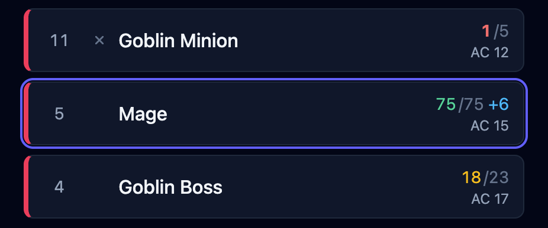
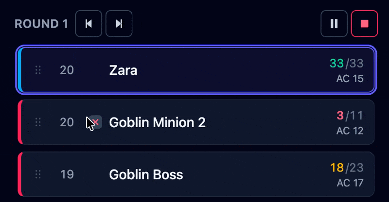

The **tracker** is the left column of the console: the list of everyone in the fight, in
initiative order. It's the column you watch. This page covers what a row shows, and how to
change hit points.

## Reading a row

Every row in the tracker holds the four things you check most often: initiative, name, hit
points, and armor class. Any effects on the creature show as badges under its name.

During a fight, the creature whose turn it is glows, and its stat block fills the middle of
the screen. Click any row to select that creature and act on it.

A creature you've chosen to keep off the shared [player view](/docs/fight/player-view/) is
tagged **Hidden**, so you can see at a glance which ones your table can't. Creatures simply
waiting for the fight to start aren't tagged. They reach your players' screen on their own
when you press **Begin**.

## Changing hit points

Click a creature's current hit points to change them. You can:

- type a **number** to set the total outright — `24`;
- type **`+5`** to heal by that much;
- type **`-8`** to deal that much damage.

Current hit points change color as a creature gets hurt, so you can spot a badly wounded
one at a glance. Temporary hit points are counted separately and consumed first when damaging a combatant.

:::tip[Damage from a player]
Typing `-8` is the quick way to apply damage from a player to a creature. When a creature
attacks, [resolve the attack](/docs/fight/attacks/) instead. OpenFray rolls the damage,
applies resistances, and takes the hit points off for you.
:::

## Rearranging the order

Once a fight is running, you can drag a row to a new spot in the initiative order, for a
held action, or to fix a number you typed wrong. See
[Encounters & initiative](/docs/fight/encounters/#rearranging-the-order).

