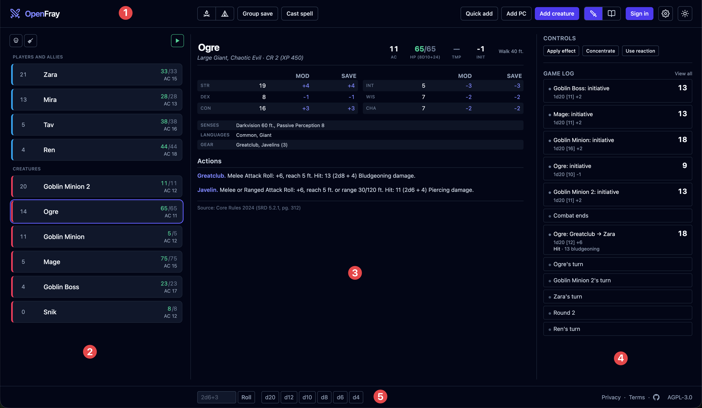
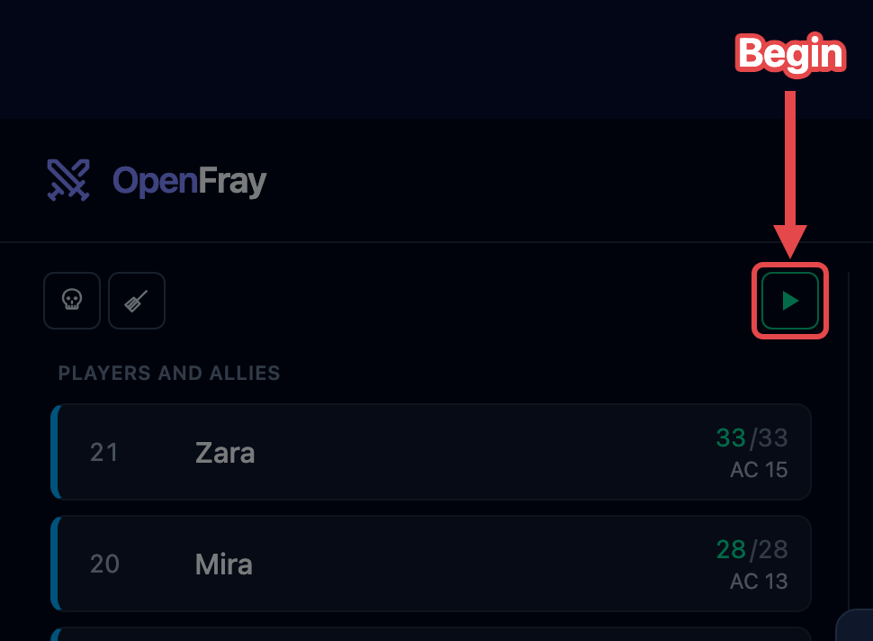
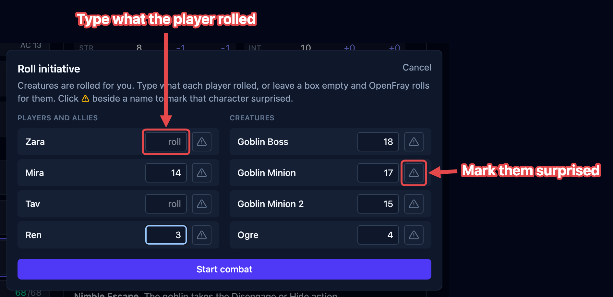

OpenFray is a combat console and initiative tracker for Dungeons and Dragons. It runs in
your web browser at [openfray.app/console](/console/). There's nothing to download and no
account needed. This page runs you through your first fight, start to finish. You can
[sign in](#saving-your-game) later if you want to save your game.

## The console at a glance

The console is one screen, split into three columns. Everything you need during a fight is
on it — nothing important is hidden in a menu.

1. **The top bar.** Adding creatures and players, group saves, casting a spell, rests, and
   the switch between the console and the compendium. On its right: signing in, the
   **screen** (sharing a [player view](/docs/fight/player-view/)), and the **gear**, which
   opens a short menu — settings, light or dark, and this handbook.
2. **The tracker.** Everyone in the fight, in the order they act, with hit points, armor
   class, and any conditions on them. This is the column you watch.
3. **The stat block.** Everything about the current or selected combatant — abilities, actions, reactions, etc. Click an attack here to roll it. See [The stat block](/docs/reference/stat-block/).
4. **Controls and the log.** Buttons for the creature you've selected — apply an effect,
   concentrate, use a reaction — and below them a running list of what has happened.
5. **The bottom bar.** Dice you can roll by hand, how hard the fight looks before it
   starts, the fight's timers once it does, and — when you're signed in — which campaign
   you're running.

## Add your creatures and players

Add everyone before the fight starts. Three buttons, for three different things:

1. **Add creature** — one from the built-in [compendium](/docs/library/compendium/).
   Type a few letters of its name and click it. You get the whole creature: attacks,
   spells, everything. Add the same one twice and the second is named _Goblin 2_, so you
   can tell them apart.
2. **Add PC** — a player. Their name, armor class, hit points, and initiative bonus is
   all OpenFray needs; players roll their own dice.
3. **Quick add** — something you're inventing on the spot and won't use again. Just a
   name, hit points, and armor class.

Until the fight starts, players and foes sit in separate groups so you can see both
sides at a glance.

## Start the fight

Everyone's on the board, so start the fight. **Begin** is the ▶ button at the top of the
tracker, where the round number appears once you're going:

Before anything starts, OpenFray asks for everyone's initiative:

- Creatures are already rolled and filled in for you.
- Players are blank. Type what each player rolled, or leave it blank and OpenFray rolls
  for them.
- The ⚠ button beside a name marks that character **surprised**.

Click **Start combat** and you're in round 1. From there:

- **Next turn (›)** moves to the next creature; at the end of the list it starts the
  next round.
- **Previous turn (‹)** steps back one turn.
- Click anyone to see their stat block and act on them.
- **Pause** holds the fight so you can pick it up later. **Stop** ends it and takes you
  back to setup, keeping everyone on the board.

When the last foe goes down, OpenFray offers to end the fight and shows you a summary of
how it went.

## Saving your game

While signed into your account, OpenFray also:

- saves your fight and syncs it to your other devices;
- keeps a list of your players, so you don't type them in again;
- lets you set up [campaigns](/docs/library/campaigns/) with your table's house rules;
- lets you build your own creatures and spells.

Nothing you've already done without an account is lost when you sign in. Saving is the game state is always automatic.

:::note[Accounts are optional]
Signing in with an account is entirely optional and **free**, via Google or Discord.
Everything above works without an account.
:::

## Where to next

- [The tracker & rows](/docs/fight/tracker/) — the full tour of the screen, and changing
  hit points.
- [Encounters & initiative](/docs/fight/encounters/) — running rounds and turns.
- [Attacks & damage](/docs/fight/attacks/) — rolling a creature's attack and applying the
  damage.
- [Saving throws](/docs/fight/saves/) — one save or a whole group at once.
- [Effects & conditions](/docs/fight/effects/) — tracking who's frightened, poisoned,
  blessed, and so on.
