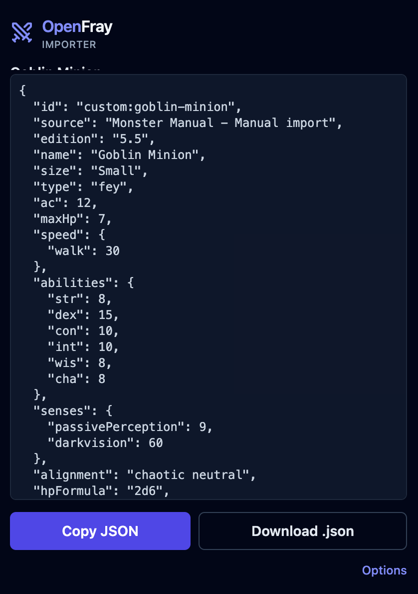

The **OpenFray Importer** is a free browser add-on. It reads a creature's page on
D&D&nbsp;Beyond and turns it into an OpenFray creature — so you don't have to type a
whole stat block in by hand.

## Get it

- **Chrome or Edge** — [OpenFray Importer on the Chrome Web
  Store](https://chromewebstore.google.com/detail/openfray-importer/cjooflanhdpfddpppllaelhlfpdinjfk).
  There's a link to it in OpenFray's **Settings** too.
- **Firefox** — on the way.

Once it's installed you'll see the OpenFray icon in your browser's toolbar.

## How to use it

1. On D&D&nbsp;Beyond, open a creature and go to its **Details** page — the one with the
   full stat block.
2. Click the **OpenFray** icon in your toolbar. The add-on reads the page and builds an
   OpenFray creature from it, showing you the result.

   

3. Click **Copy JSON**. (**Download .json** saves it as a file instead, if you'd rather
   keep it or send it to someone.)
4. In OpenFray, open the compendium's **Creatures** tab and choose **Import a creature**.
   Paste what you copied into the box and click **Import**.

   

The creature is saved to your library as an ordinary custom creature — you can edit it
afterwards like anything you built yourself, and drop it into any fight. Because it's
saved to your library, this last step needs an account.

## What it brings across

The importer maps the whole stat block, including:

- abilities, armor class, hit points, speed, and senses;
- attacks, saving throws, and recharge abilities;
- legendary actions;
- the spell list;
- the flavor description.

It works out from the page whether the creature uses the 2014 or 2024 rules.

Two things it doesn't handle yet: 2014 innate spellcasting written into a creature's
traits, and mythic actions.

## What it can and can't see

The importer only reads the page you're looking at, and only when you click it. It
carries no game content of its own — it just reformats the creature already on your
screen into OpenFray's format, on your own computer. It's a free, unofficial fan tool,
not made or approved by Wizards of the Coast or D&D&nbsp;Beyond.
