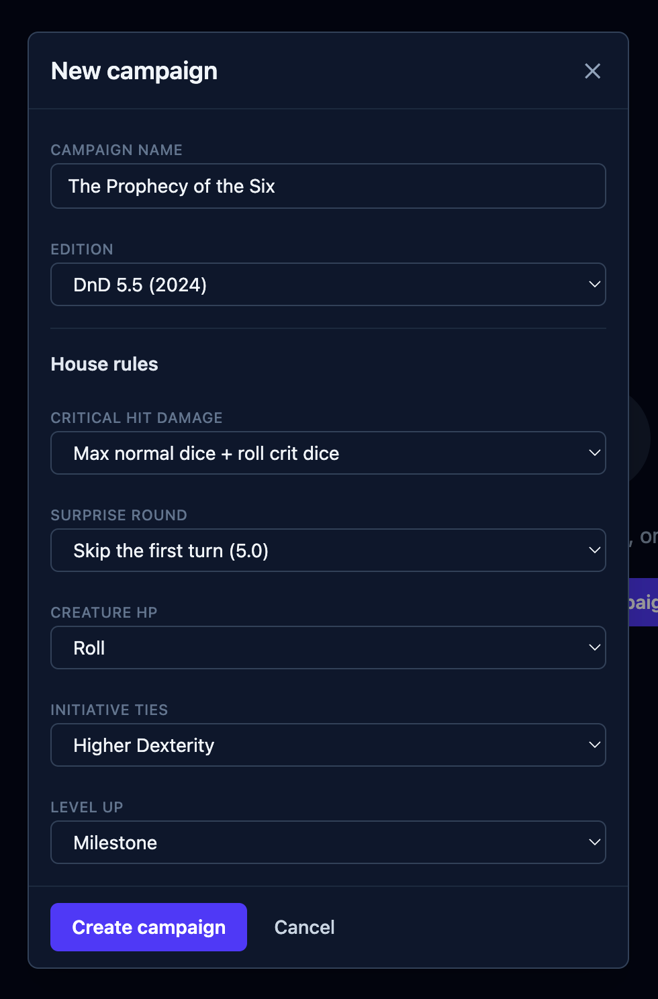
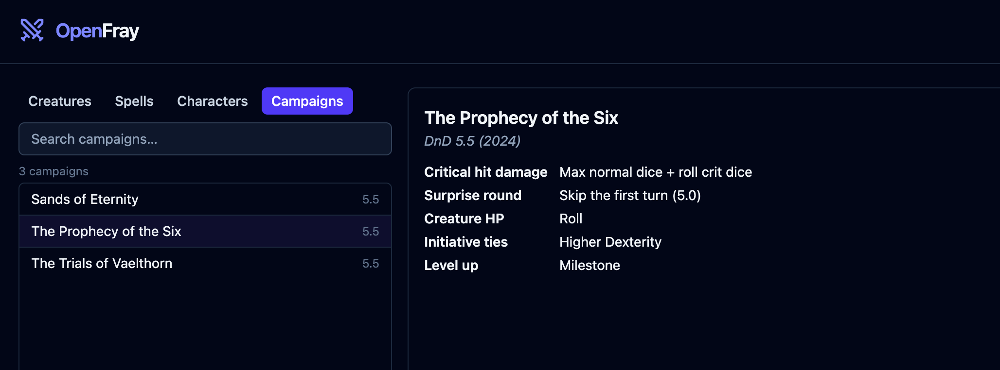

A **campaign** is where you keep one game together. It holds the rules your table uses,
so you set them once and they apply to every fight you run. Pick the campaign you're
running from the box at the bottom of the console. Without a campaign OpenFray just uses
the default rules.

Make and edit campaigns on the **Campaigns** tab of the
[compendium](/docs/library/compendium/#campaigns). Each one shows its rules at a glance,
and you can change them right there.

:::note[Sign in required]
Creating and using a campaign and its rules requires an account. Sign in with a free
Google or Discord account. Without an account OpenFray uses the default rules.
:::

## Which rules it's for

Each campaign is labeled **DnD 5.5 (2024)** or **DnD 5.0 (2014)**, so you can tell your
games apart at a glance. Which creatures and spells you actually see is a separate
choice, in [Settings](/docs/reference/settings/#libraries), so one setting covers
you whether or not you're signed in.

## House rules

| Rule                    | What you can choose                                                                              |
| ----------------------- | ------------------------------------------------------------------------------------------------ |
| **Critical hit damage** | _Double the dice_ (standard); _Max normal dice + roll crit dice_ (brutal); or _Double the total_ |
| **Surprise round**      | _Initiative with disadvantage_ (DnD 5.5e); or _Skip the first turn_ (DnD 5e)                     |
| **Creature HP**         | _Average_, _Roll_, _Min_ or _Max_, calculated as each creature joins the fight                   |
| **Initiative ties**     | _Higher Dexterity_; _Players first_; or _Manual_, leaving the order to you                       |
| **Level up**            | _XP_, or _Milestone_                                                                             |

The crit and hit-point rules change the dice OpenFray rolls for creatures. It never
rolls a player's attack. The surprise and tie rules change the initiative order.

Once a campaign exists, its card lists every rule at a glance, so you can check what this
table plays without opening the form:

## Running a campaign

Pick which one you're running from the box at the bottom right of the console. That's
what applies its rules to the fight in front of you:

Selecting a campaign does not affect the combatants already added in the initiative
tracker. Add new creatures to recalculate their hit points, or add new player characters
as necessary.

## Leveling up: experience or milestone

- **Experience points** — the usual way. The experience points awarded by each creature
  show on stat blocks and in the end-of-fight summary, as a total and split for each
  player on the board (excluding friendly NPCs).
- **Milestone** — you level the party up at story moments, so experience is just noise.
  Pick this and OpenFray hides it during a fight and in the summary.

The [compendium's creature list](/docs/library/compendium/#creatures) always shows
experience, whichever you pick. It is a reference, not a scoreboard.
