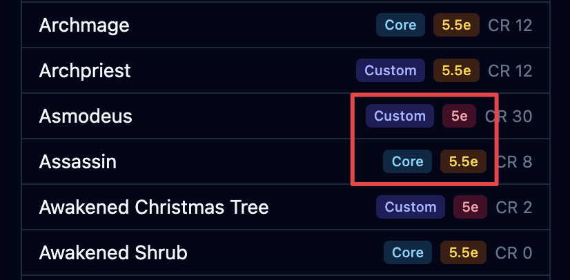
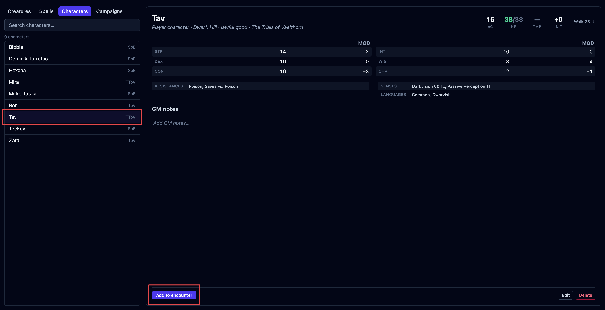

The **compendium** is the reference OpenFray keeps for you. Open it with the book icon at
the top of the screen.

1. **The tabs** — creatures, spells, your characters, your campaigns.
2. **The list** — search by name; every match shows here.
3. **What you picked** — the full stat block or spell card, in the same layout you'll see
   during a fight.

Each row in the list is badged with where it came from, so you always know which book and
which rules you're looking at:

## Creatures

Every creature you can use from the [rule sets you selected](#rule-sets), with its full stat block. This is the same list you pick from
when you click **Add creature**.

Each row is badged with the book it came from and which rules it uses, so you always know
what you're looking at. If it's one of your homebrew creations, the badge will show **Custom**.

## Spells

Every spell in the rule sets you selected, with its full card:
casting time, range, components, how long it lasts, and what it does. You'll see the same
card when you cast a spell, or when you point at a spell name inside a stat block.

## Characters

Your saved players. Build a character once — armor, hit points, abilities, resistances,
senses, and private GM notes — and drop them into any fight instead of typing them in
again.

:::note[Sign in required]
Saving and reusing player characters requires you to sign in with a free Google or Discord account.
:::

The campaign each character belongs to is shown beside their name in the list, so a table's party stays recognisable when you
run more than one game. Click the **Add to encounter** button to add them straight on the initiative tracker.

## Campaigns

Your games and their house rules. See
[Campaigns & house rules](/docs/library/campaigns/).

:::note[Sign in required]
Saving and using campaigns requires you to sign in with a free Google or Discord account.
:::

## Rule sets

The compendium shows the books you've turned on. OpenFray ships with:

- **Core Rules 2024** (DnD 5.5e) — the newer rules. On by default.
- **Core Rules 2014** (DnD 5e) — the older rules. Turn this on if that's what your table plays.
- **Tome of Beasts 1, 2, and 3** (DnD 5e) — three books of extra creatures from Kobold Press.

Select the ones your table uses in **Settings**. See [Settings & appearance](/docs/reference/settings/#rule-sets).

## Homebrew content

You can build your own **creatures** and **spells** in a full editor, and
they're kept in your library next to the built-in ones. See [Build your own](/docs/library/making-your-own/).

:::note[Sign in required]
Creating homebrew creatures and spells requires you to sign in with a free Google or Discord account.
:::

To turn a D&D&nbsp;Beyond creature into an
OpenFray creature without retyping it, see [the importer](/docs/library/importer/).

:::note[Where the rules come from]
The built-in rules come from the official System Reference Document, used under the
CC-BY-4.0 license. The Tome of Beasts books are used under the Open Game License. Full
credit for every source is in the app. OpenFray is compatible with fifth edition and
isn't made or approved by Wizards of the Coast.
:::
