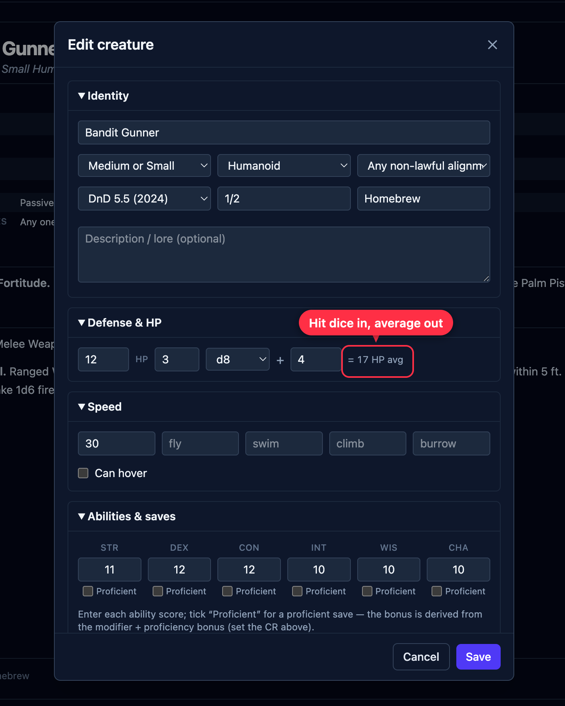
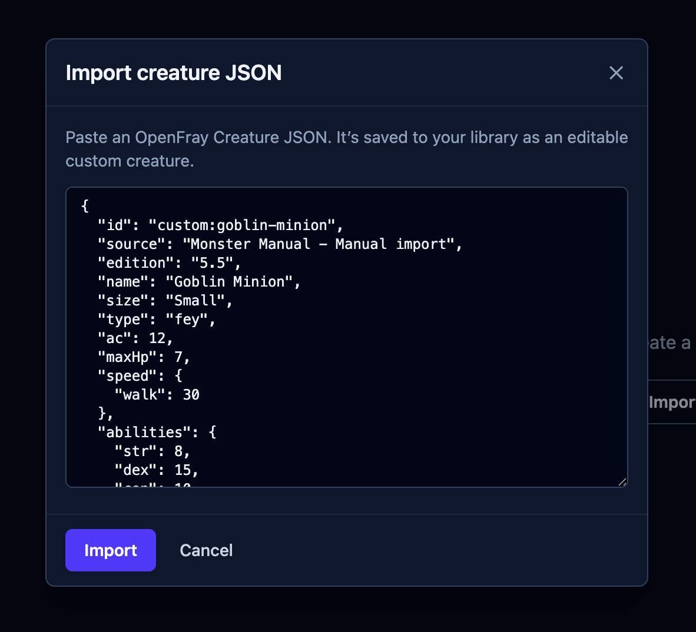
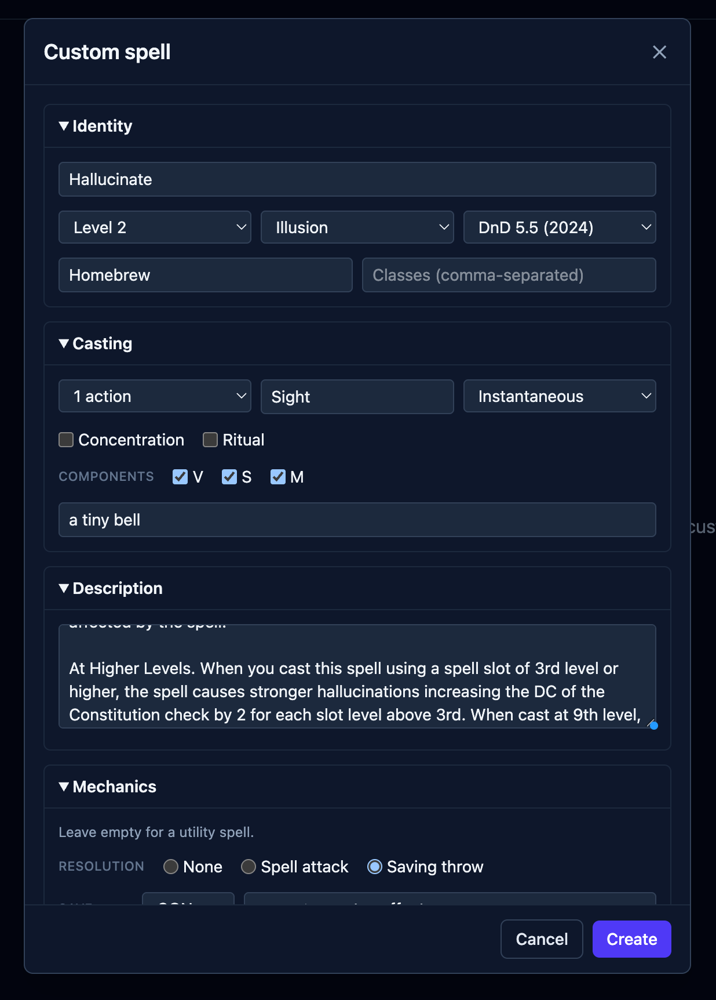

The built-in books don't have everything — some famous creatures aren't in the SRD at
all, and your table has its own inventions. So you can build your own, and they sit in
your library next to the built-in ones, ready to drop into any fight.

:::note[Needs an account]
Your creations are saved to your account, so this needs you to be signed in. Everything
else in the compendium works without one.
:::

Both editors live in the [compendium](/docs/library/compendium/): open the
**Creatures** or **Spells** tab and use the create button.

## Making a creature

The form is a whole stat block, broken into collapsible sections you can work through in
any order — **Identity**, **Defense & HP**, **Speed**, **Abilities & saves**, then
skills, senses, traits, actions, reactions, legendary actions and spellcasting.

**You enter what's true about the creature, and OpenFray does the arithmetic** from it:

- Give it a **challenge rating**, in Identity, and OpenFray knows its proficiency bonus.
  Everything below depends on it, so set it early.
- In **Defense & HP**, give the **hit dice** — how many, which die, and any modifier. The
  average appears beside them (_"= 17 HP avg"_), and that's the number the creature
  enters play with.
- In **Abilities & saves**, type the six scores and tick **Proficient** on the saves it's
  good at. The bonus is the modifier plus the proficiency bonus; you never type it.
- Skills work the same way — tick proficient, tick expertise where it applies.
- For an attack, pick **which ability** it swings with. The to-hit is that ability's
  modifier plus proficiency, and the modifier is baked into the damage the way printed
  stat blocks do it.
- For spellcasting, pick the **ability**; the save DC and spell attack bonus follow.

Every derived number updates as you type, so you can check them as you go. If one looks
wrong, fix the ability score or the challenge rating behind it, not the total.

### Importing instead of typing

If the creature already exists on D&D&nbsp;Beyond, don't retype it — the
[importer](/docs/library/importer/) turns that page into an OpenFray creature. Paste what it
gives you into **Import a creature**, on the Creatures tab:

What lands in your library is an ordinary custom creature: editable, yours, and no
different from one you built by hand.

## Making a spell

The spell form covers the card, in the same collapsible sections: **Identity** (name,
level, school, rules version), **Casting** (time, range, duration, concentration, ritual,
components), **Description**, and **Mechanics** — where you say whether the spell resolves
as _nothing_, a _spell attack_, or a _saving throw_. Leave Mechanics empty and you get a
utility spell: OpenFray shows the card and lets you adjudicate.

Two things are worth calling out.

**There's no save DC.** A spell doesn't own its DC — the creature casting it does. Say
the spell needs a Dexterity save, and OpenFray uses the caster's number when it's cast.

**Casting at higher levels** usually follows a pattern, so you describe the pattern once:
give the extra damage **per slot above the spell's base level** (or, for a cantrip, per
tier as the caster levels up), and OpenFray expands that into the actual damage at every
level, showing you the result as you type. For spells that don't follow a neat pattern,
switch to **Edit each level** and set them by hand.

## Living with your own content

Your creatures and spells:

- appear in the compendium beside the built-in ones, badged **Custom**;
- show up in the **Add creature** and **Cast spell** pickers;
- are always available, whichever [rule sets](/docs/reference/settings/#rule-sets) you
  have turned on;
- can be edited or deleted later from the bottom of their own card.

Editing one **doesn't change a fight already in progress** — a creature you added to the
board is a copy, taken at the moment you added it. Add it again to pick up your edits.
