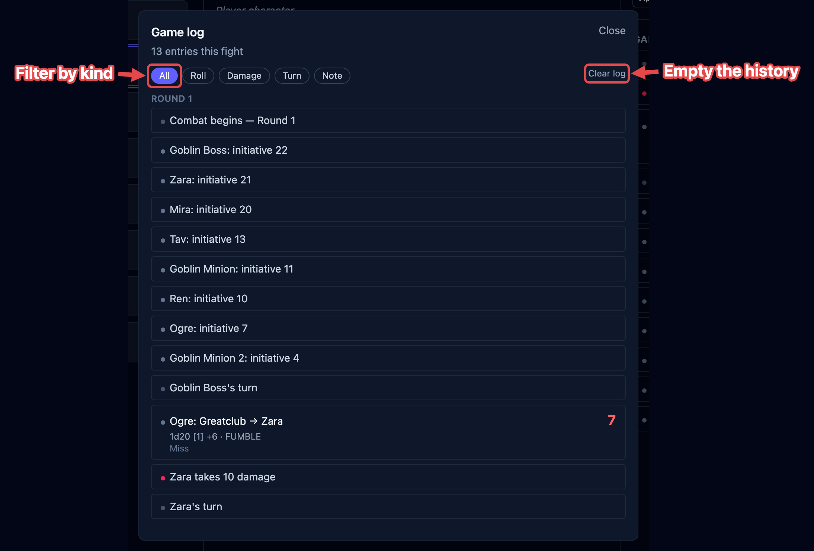

The **game log** is the record of everything that happens in a fight: every roll, every
spell, every point of damage, every condition. It writes itself as you play, so nothing is
rolled in secret and "what just happened?" is answered by looking. This page covers the
sidebar feed and the full history.

## The sidebar feed

The bottom of the right-hand column shows **Game log** — the most recent entries, newest
first. It's the running feed you watch during a fight.

Each line carries a colored dot for its kind, so a roll, a spell, and a hit are easy to tell
apart at a glance. A resolved attack collapses into a single line: the to-hit, the outcome,
and the damage by type.

## The full history

Click **View all** to open the full history. It's grouped by round, oldest first, so you can
retrace the whole fight from the top.

<!-- TODO screenshot: game-log-modal.png — the full history modal, grouped by round. Highlight: the category filter chips, a round grouping, Clear log. -->

<!--  -->

### Filtering by kind

The chips along the top filter the history to one kind of entry. Only the kinds present in
this fight are shown:

| Filter            | What it shows                                    |
| ----------------- | ------------------------------------------------ |
| **All**           | Everything, in order.                            |
| **Roll**          | Dice rolls — attacks, saves, checks, initiative. |
| **Spell**         | Spells cast.                                     |
| **Action**        | Actions used.                                    |
| **Condition**     | Conditions and effects applied or cleared.       |
| **Concentration** | Concentration started, held, or broken.          |
| **Damage**        | Hit-point damage dealt.                          |
| **Heal**          | Healing.                                         |
| **Turn**          | Turn and round changes.                          |
| **Rest**          | Short and long rests.                            |
| **Death**         | Death saves and knockouts.                       |
| **Note**          | Notes you left, and anything else.               |

**Clear log** empties the history. It's also cleared when you remove everyone from the board
with the skull (see [Rests & clearing the board](/docs/fight/rests/#clearing-the-board)); a
plain **Stop** keeps it.

## What gets logged

You don't have to write anything down. OpenFray logs the fight beginning and ending, each
turn and round, spells cast, damage and healing, conditions and effects applied and cleared,
concentration starting and breaking, knockouts and death saves, and rests. Roll a die by
hand from the [dice bar](/docs/reference/dice/) and that lands in the log too.
