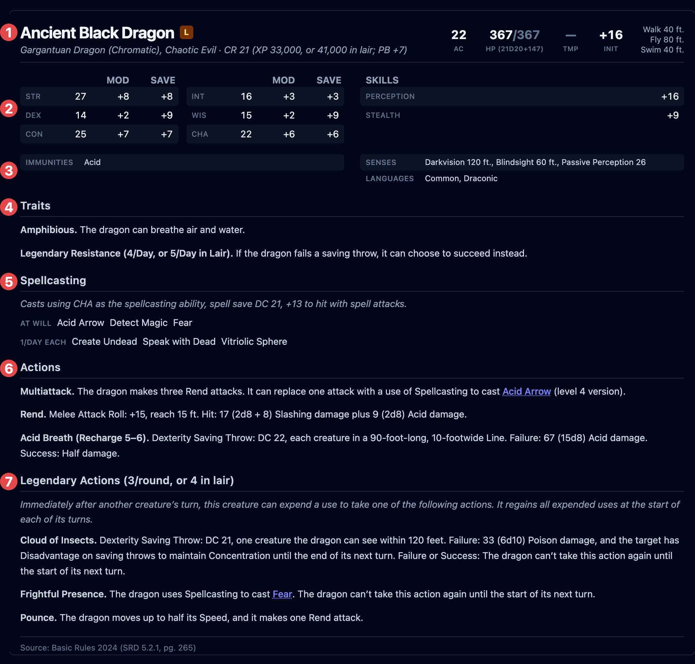

The **stat block** is the full picture of a creature — the middle column when you select
one, and the reading pane in the compendium. It's the same layout printed books use. This
page names each part and points out what you can click during a fight.

Select a creature to see its stat block. The one for a player character is shorter, and is
covered under [Creatures, players & quick adds](/docs/fight/combatants/).

<!-- TODO screenshot: stat-block-full.png — a rich creature (a legendary spellcaster, e.g. an archmage or a dragon) in the compendium. Number each section: header, abilities, defenses, traits, spellcasting, actions, legendary actions. -->

<!--  -->

## The header

The top of the block carries the creature's identity and its headline numbers:

- **Name**, and below it the **size, type, and alignment**, then the **challenge rating**
  with its XP — for example, _Large Dragon, chaotic evil · CR 10 (5,900 XP)_.
- **AC** — armor class.
- **HP** — hit points; a creature also shows the hit-dice formula it rolled from.
- **TMP** — temporary hit points, counted separately and used up first.
- **Init** — the initiative modifier.
- **Speed** — walking speed and any others (fly, swim, burrow, climb).

A legendary creature is marked as such under the header.

## Abilities, saves, and skills

The six ability scores, each with its modifier and — where the creature is proficient — its
**saving throw** bonus. Alongside them, any **skills** the creature is proficient in.

## Defenses and senses

Below the abilities:

- **Resistances**, **immunities** (including condition immunities), and **vulnerabilities**;
- **Senses**, including passive Perception and any darkvision or the like;
- **Languages**;
- **Gear**, when the creature carries any.

These defenses are what OpenFray applies when the creature takes damage. See
[Attacks & damage](/docs/fight/attacks/#resistance-immunity-and-vulnerability).

## Traits, actions, and the rest

The lower half lists what the creature can do, in the usual order:

- **Legendary Resistance** — during a fight, its own section with a uses-left counter.
- **Traits** — always-on features (Amphibious, Magic Resistance, Pack Tactics).
- **Spellcasting** — the creature's spells, grouped by how often it can cast them.
- **Actions**, **Bonus Actions**, and **Reactions**.
- **Legendary Actions** and **Lair Actions** for creatures that have them.
- A collapsible **Description** with the creature's flavor text, where the source has it.

At the very bottom, a **source line** names the book and page the creature comes from — for
example, _Core Rules 2024 (SRD 5.2.1, pg. 320)_.

## What you can click in a fight

During a fight, the parts that roll or spend something are clickable:

| Click this                           | And it does                                                                          |
| ------------------------------------ | ------------------------------------------------------------------------------------ |
| An **ability** or **skill**          | Rolls that check (a creature's own).                                                 |
| An **action** with an attack or save | Opens the [attack](/docs/fight/attacks/) or [save](/docs/fight/saves/) box.          |
| A **spell**                          | Casts it — see [Spells](/docs/fight/spells/).                                        |
| A **legendary action**               | Spends it from the round's budget. See [Creature resources](/docs/fight/resources/). |
| A **recharge** ability               | Spends it; OpenFray rolls to recharge on the creature's turn.                        |

Everything else — traits, the descriptive text of an action — is there to read. OpenFray
never rolls a player's dice, so a player character's abilities show the modifier only, and
you enter what the player rolled.
