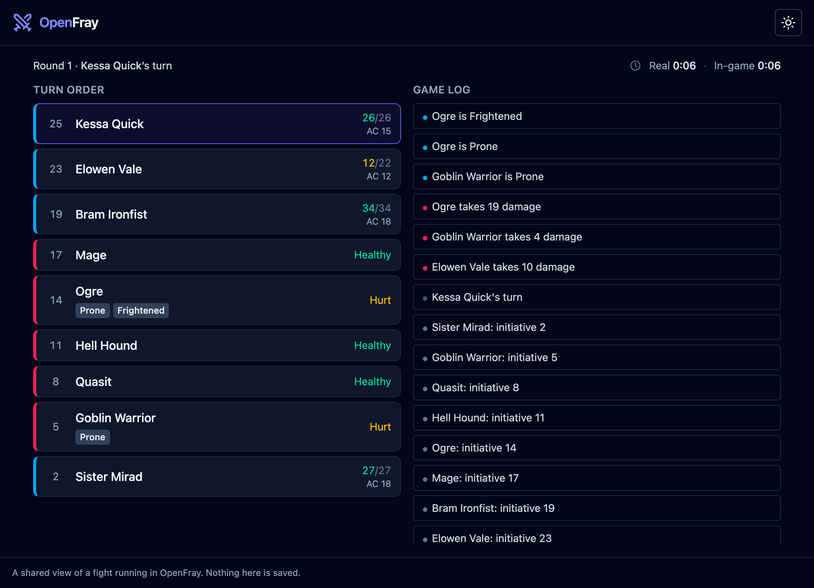
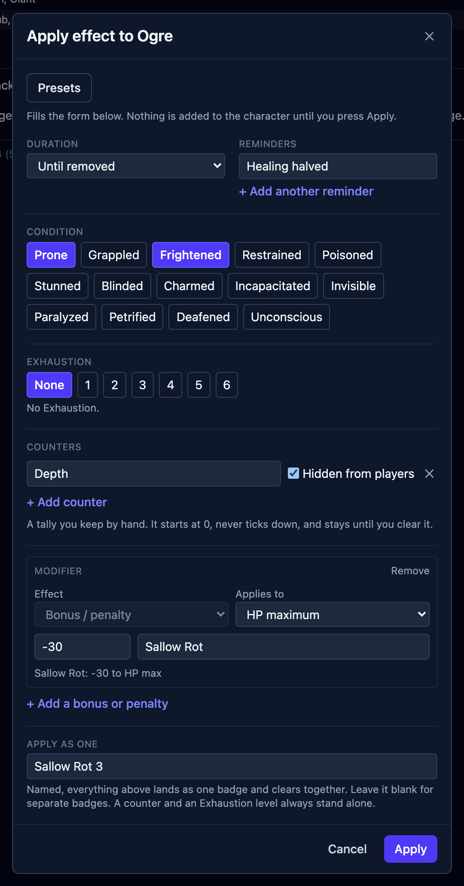

The version number moved to 1.0.0 and the beta label is gone. Nothing about the way you
use OpenFray changed. [The console](/console/) is still a browser tab, still needs no
account, and still keeps your fight in that tab until you decide otherwise.

[The beta](/news/openfray-beta-release/) named one thing as still to come: a read-only
view your table could look at. That is what 1.0 is.

## The player view

Your table now gets a screen of their own. Share a link, and everyone reading it sees the
turn order and the game log on their own phones, updating as you run the fight.

What reaches that screen is yours to decide:

- **Hide a creature, or reveal it early.** A creature the party hasn't seen stays off the
  view until you show it.
- **Keep a creature's conditions to yourself.** The table sees that something is happening
  without seeing which effect you applied.
- **Let a creature fight for the party.** A summoned bear or a charmed guard sits with the
  players rather than against them.

The shared log tells the table what happened, not the arithmetic behind it. A creature's
action reaches it by name, and its roll by total, with the dice left out. A saving throw
is settled before it is shared, so nobody reads the result over your shoulder before you
do. The fight's clocks, the damage each side has dealt, and the summary at the end all go
across too.

The log starts fresh with each fight, sharing survives a reload, and it ends when you
close the tab. A link can be named, so you can tell one table's view from another's.

Every part of it is written up in [the handbook](/docs/fight/player-view/).

## Effects, rebuilt

Applying an effect used to mean one condition, one modifier, or one reminder. It can now
be all of them at once, staged in the **Apply effect** box and applied together as a
single named bundle that logs as one line and clears as one thing.

- **Modifiers know which ability they apply to.** A bonus to Dexterity saving throws no
  longer attaches itself to a roll that has nothing to do with Dexterity. Bless and Bane
  are scoped to attacks and saves, the way they are written.
- **An effect can be yours alone.** Mark it for the Game Master, and the count you are
  keeping stays off the table's screen.
- **Effects reach a character's numbers.** Armor class, initiative, hit point maximum and
  Speed are derived for a saved character, and an effect can move any of them. A Speed
  modifier can halve it, double it, or drop it to 0.
- **Casting a spell lands everything the spell does**, as one bundle named for it. Every
  spell in the console was re-read against the rules text of both editions in the process.
- **Exhaustion has a level**, and lands from an attack or a saving throw like anything else.
- **Save an effect you use often as a preset.** The diseases from _Brood & Bloom_ ship as
  presets already.

## Dice you can check

Rolling moved to [opendice](https://github.com/SirDarcanos/opendice), a small package
built for this and free for anyone else to use. It rolls each die through a cryptographic
generator and hands back every die it rolled, so the log can show its working.

An advantage roll shows both dice and says which one counted. A damage roll shows the dice
behind the total. Every roll carries to its total with an arrow, and a natural 1 is named
a critical miss rather than left to be noticed. There is a reroll wherever OpenFray rolls.
A group saving throw applies each creature's own resistances and immunities by damage type,
and says what it rolled for whom.

## A new book, and a new library

**[On Strong Waters and Potent Simples](/strong-waters/)** is the third book OpenFray
writes, and the first with no creatures in it. Hesper Aldwine's eight chapters cover
drink, smoke and the simples: what they do, what they cost, where they are found, and what
happens to someone who keeps taking them. It ships with three appendices, a print edition,
and 11 spells you can cast from the console. Its three counts are effect presets:
Intoxication, Craving and Addiction. Running an addiction at the table is a click rather
than a note in the margin.

**Creature Codex** joins the opt-in libraries, alongside the three Tome of Beasts books.
Tick it in **Settings** and its creatures appear in the compendium with their own source
line.

_Brood & Bloom_ also gained its spells as a castable library, and the Hands of the Host.

## Where to start

If you have never opened it, [getting started](/docs/getting-started/) runs you through one
fight from an empty board to the summary at the end. If you already run OpenFray, the
[player view](/docs/fight/player-view/) is the page worth reading first.

Every version so far, and what each one changed, is in the
[changelog](https://github.com/SirDarcanos/openfray/blob/main/CHANGELOG.md).
