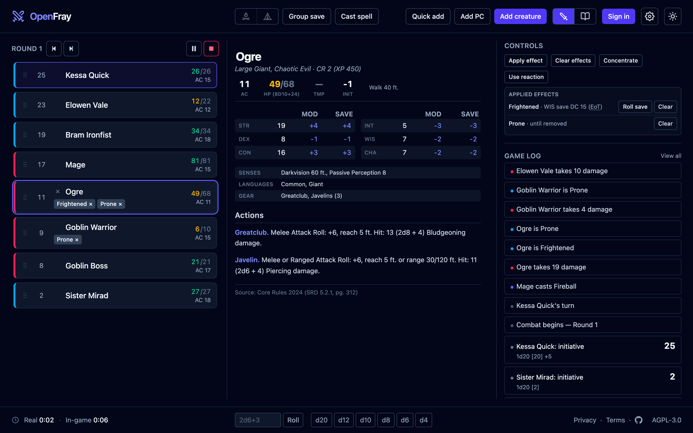

OpenFray started as a scratchpad for one table and one Game Master. It now runs a fight
end to end, so it is open to anyone who wants it: [the console](/console/) is a browser
tab, it needs nothing installed, and it needs no account.

It is alpha, and the word is meant. Expect rough edges.

## The fight itself

The console is one screen, three columns: everyone in the fight down the left, the
selected creature's stat block in the middle, its controls and the log on the right.

Click **Begin** and OpenFray asks for everyone's initiative — it rolls the creatures and
leaves the players blank for you to type what they rolled. From there, moving to the next
turn does more than move a marker. Timed effects count themselves down and clear,
creatures get their reaction back, recharge abilities roll to see whether they return, and
a creature makes the saving throw that ends an effect at the start or the end of its turn,
whichever you chose.

Turns are tracked by the creature rather than by its place in the list, so adding someone
mid-fight or dragging a row to a new spot never loses whose turn it is. Nothing is deleted
when it dies: a fallen creature stays in the order, grayed out and skipped, in case it
comes back.

## Effects are one thing, not two

This is the part OpenFray is built around. Whatever caused it, what lands on a creature is
always one of a handful of shapes: a condition, advantage, disadvantage, a bonus or
penalty, a reminder, or something a saving throw ends. OpenFray models those, and nothing
else.

The useful consequence is that effects have two ends. An effect can sit on a creature and
change the rolls that creature makes, or change the rolls made **against** it. So the
barbarian's Reckless Attack goes on the barbarian and grants advantage to whoever swings
at them, and Vicious Mockery goes on the goblin and spoils the goblin's next attack. Both
are the same box, filled in differently, and both are worked into the roll when it
happens.

Anything the app doesn't know about becomes a reminder in your own words. It shows on the
row until you clear it, and it applies nothing — you decide what it means.

## What creatures have left to spend

A creature's resources run down as you use them, and come back when they should: legendary
actions and their per-round budget, legendary resistance with its separate in-lair count,
recharge abilities, limited-use actions, spell uses counted per spell, and the one reaction
each creature gets per round.

Spellcasting is live from the stat block. Click a spell and OpenFray fills in that
creature's save DC and attack bonus, spends the use, and routes the spell into the attack
box or the group save. A concentration spell starts the caster concentrating, with a timer.

## Rolling, and being trusted about it

Attacks resolve from the stat block: pick a target, roll to hit against its armor class,
then apply damage that already accounts for what the target resists, is immune to, or is
vulnerable to. Critical hits follow your table's rule.

**Group save** is the fireball case — one saving throw, every target at once, each rolling
its own die with its own bonus, Magic Resistance and Evasion worked in, and the damage
applied in one step, full or half per creature. A creature with legendary resistance that
fails can turn the failure into a success from the same box.

Every die goes through one place and lands in the log with its numbers showing. Nothing is
rolled in secret and nothing is nudged: the dice use the browser's cryptographic random
generator, and there is no smoothing of streaks anywhere in the code. Real dice clump, so
these do.

Players roll their own dice. Wherever OpenFray would roll for a creature, it asks you what
the player got instead.

## Your creatures, your table

The built-in compendium carries the SRD's creatures and spells, searchable, with full stat
blocks and spell cards. Beyond it:

- **Build your own.** A full stat-block editor for creatures and a card editor for spells.
  You give the ability scores and the challenge rating; OpenFray derives the attack
  bonuses, save and skill bonuses, and the spell save DC from them.
- **Save your players.** Build a character once — armor class, hit points, abilities,
  defenses, senses, and private notes — and drop them into any fight instead of typing
  them again.
- **Campaigns.** Your table's rulings, set once: critical hit damage, how surprise works,
  how creature hit points are rolled, and how initiative ties break. Every fight you run
  under that campaign uses them.

## Signing in is optional

Everything above runs with no account. Your fight lives in the browser tab and survives a
reload or a crash; closing the tab is what ends it, and OpenFray warns you first.

Sign in — free, with Discord or Google — and your fight, your creatures, your spells, your
characters and your campaigns are saved to your account and follow you between devices.
Nothing you did before signing in is thrown away.

## What isn't here

A shared read-only player view: a second screen your table can watch, showing turn order
and conditions without showing them your notes. The data is already shaped for it. It is
the next real thing.

Until then, [open the console](/console/) and run a fight. If something is wrong — a rule
OpenFray gets backwards, a creature it renders badly — the
[issue tracker](https://github.com/SirDarcanos/openfray/issues) is read.
